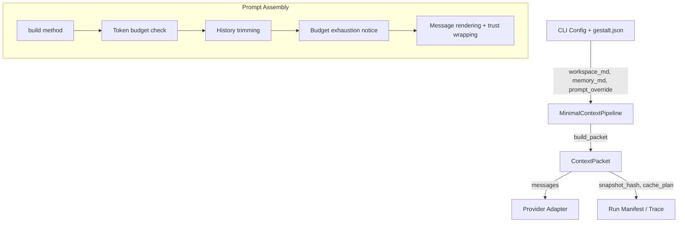

# Gestalt Context Crate (`gestalt-context`)

The `gestalt-context` crate provides the **context pipeline middleware** for the Gestalt agent harness. It implements the `ContextPipeline` trait from `gestalt-core`, assembling the prompt (system instructions, workspace/memory files, conversation history) into a `ContextPacket` that the provider adapter sends to the LLM.

This crate is the single implementation of prompt assembly that ships with Gestalt. It is used by both the CLI and the runtime composition layer.

---

## Architecture



---

## Quick Start

```rust
use gestalt_context::MinimalContextPipeline;
use gestalt_core::{ContextPipeline, TokenBudget, PromptAssemblyStrategy};

let pipeline = MinimalContextPipeline::new("pipeline-v1")
    .with_workspace_md("## Workspace Rules\n...")
    .with_memory_md("## Memory\n...")
    .with_prompt_assembly_strategy(PromptAssemblyStrategy::Snapshot)
    .with_mode("Confirm")
    .with_max_turns(50)
    .with_available_tools(vec!["bash".into(), "read".into(), "write".into()]);

let budget = TokenBudget {
    model_limit: 128_000,
    reserved_output: 8_192,
    minimum_turn_budget: 1_024,
    ..Default::default()
};

let packet = pipeline.build_packet(&history, &budget);
// packet.messages is ready to send to the provider
```

---

## Cache-Aware Prompt Assembly

The pipeline supports two assembly strategies via `PromptAssemblyStrategy`:

| Strategy | Behavior | Cache Effect |
|----------|----------|--------------|
| `Dynamic` (default in core) | All messages are interleaved in insertion order | Cache miss on every turn — any new message before history invalidates the prefix |
| `Snapshot` (default in CLI) | Stable system messages are grouped into a cacheable prefix; conversation and ephemeral messages follow in an uncached tail | Cache hit on the stable prefix across turns |

### How It Works

When the pipeline is configured with `PromptAssemblyStrategy::Snapshot`:

1. **Stable prefix identification:** All `Message::System` entries that are *not* budget-exhaustion notices are treated as the stable prefix. This includes the system prompt, `workspace.md`, and `memory.md`.

2. **Snapshot computation:** A `PromptSnapshot` is created from the stable prefix messages, producing:
   - `snapshot_hash` — SHA-256 of the message list
   - `prefix_hash` — SHA-256 of the serialized message content

3. **Segment classification:** The assembled messages are split into segments:
   | Segment Kind | Content | Stability |
   |---|---|---|
   | `Snapshot` | System prompt, workspace.md, memory.md | `SessionStatic` |
   | `Conversation` | User/assistant messages, tool results from history | `TurnDynamic` |
   | `Ephemeral` | Budget exhaustion notices | `Ephemeral` |

4. **Cache plan:** A `PromptCachePlan` is generated and attached to the `ContextPacket`. Provider adapters (e.g. Anthropic) use the cache plan to set `cache_control` breakpoints at the boundary between stable and dynamic segments.

### Snapshot Stability Guarantee

The snapshot hash is stable across turns as long as the stable prefix content doesn't change:

```rust
let pipeline = MinimalContextPipeline::new("pipeline-v1")
    .with_prompt_assembly_strategy(PromptAssemblyStrategy::Snapshot)
    .with_workspace_md("workspace rules");

let first = pipeline.build_packet(&[user_msg("first turn")], &budget);
let second = pipeline.build_packet(&[user_msg("second turn")], &budget);

assert_eq!(first.snapshot_hash, second.snapshot_hash);
// Different history -> different packet hash, but same snapshot
assert_ne!(first.packet_hash, second.packet_hash);
```

When workspace.md or memory.md changes, the snapshot hash changes — and the provider cache will miss on the next request, which is correct behavior.

### Resume Reuse

On session resume, the CLI loads the previous run's snapshot and reuses it rather than recomputing. This is handled by the runtime composition layer (`gestalt-runtime`), not by the pipeline itself. See [ADR-026](../../docs/adrs/ADR-026-cache-aware-prompt-assembly.md) for the full lifecycle.

---

## Token Budget & History Trimming

The pipeline respects token budgets:

- **Critical context** (system prompt, workspace.md, memory.md) is always included.
- **History** is iterated in reverse and included until the remaining budget is exhausted. Oldest messages are dropped first.
- **Budget exhaustion notice:** When messages are dropped, a `Message::System` notice is appended: `"context budget exhausted or truncated; dropped N history message(s)"`. This notice is classified as `Ephemeral` in the snapshot strategy so it doesn't invalidate the stable prefix.

---

## Content Trust

Untrusted content (external documents, tool results) is rendered inside `<source>` wrappers with `trust="external_untrusted"` attributes. This prevents prompt injection from external sources:

```rust
// A user message containing an untrusted document:
Message::User {
    content: vec![ContentBlock::Document {
        source: DocumentSource {
            media_type: "text/markdown".into(),
            data: "external content".into(),
        },
        title: Some("external.md".into()),
        trust: ContentTrust::Untrusted,
    }],
}

// Is rendered as:
// <source kind="document" trust="external_untrusted">
// title="external.md"
// media_type="text/markdown"
// ---
// external content
// </source>
```

Trusted documents and system messages pass through unchanged.

---

## Override Prompts

The pipeline supports prompt overrides at three levels:

1. **Default** — the built-in `DEFAULT_SYSTEM_PROMPT` (used when no override is set)
2. **Inline override** — `with_prompt_override("Custom instruction")`; sets `prompt_source = "override"`
3. **File override** — `with_prompt_override_file(".gestalt/system_prompt.md", content)`; sets `prompt_source` to the file path

Empty/whitespace-only overrides fall back to the default prompt. The `prompt_source` field in `ContextPacket` records which source was used.

---

## Config Surface

In `gestalt.json`:

```json
{
  "prompt": {
    "override": "Custom system prompt text (optional)",
    "override_file": ".gestalt/system_prompt.md",
    "assembly_strategy": "snapshot"
  },
  "tools": {
    "bash_timeout_secs": 60,
    "max_output_tokens": 4000
  }
}
```

The `assembly_strategy` field controls the pipeline strategy. When omitted, the CLI defaults to `"snapshot"`; the bare pipeline defaults to `"dynamic"`.

---

## Testing

```bash
cargo test -p gestalt-context
```

Key test areas:
- Deterministic output for identical inputs
- History trimming preserves newest messages first
- Untrusted documents are rendered with trust wrappers
- Budget exhaustion notices are classified as ephemeral segments
- Snapshot hash stability across varying conversation history
- Dynamic strategy leaves cache metadata empty
