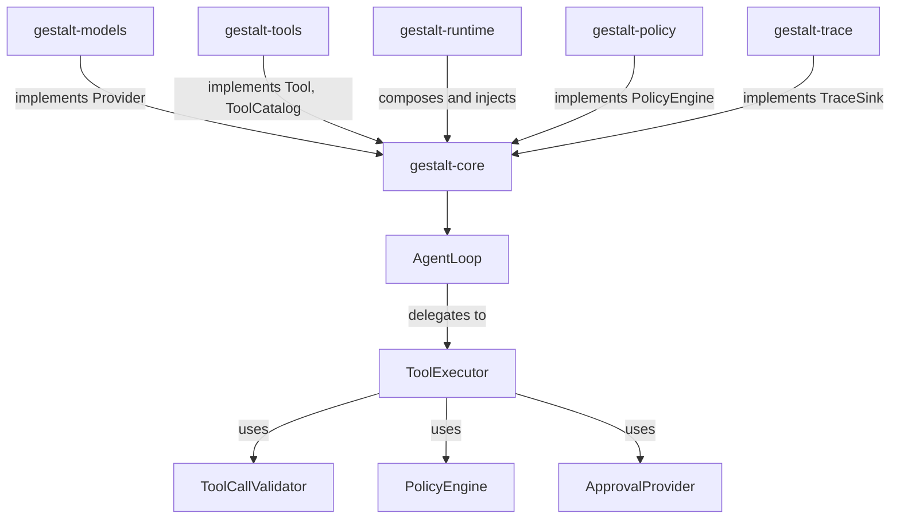

# Gestalt Core Crate (`gestalt-core`)

Core traits, events, agent loop, and session types for gestalt-harness. **Zero I/O, zero HTTP.** All provider communication, filesystem access, and process management live in higher crates.

This crate defines the abstract skeleton that every other gestalt crate implements against. If a type is referenced by two or more crates without depending on the network or the filesystem, it belongs here.

---

## Architecture Overview

`gestalt-core` sits at the bottom of the dependency graph. Higher crates inject concrete implementations of its traits:



---

## Core Abstractions

### Agent Loop (`agent.rs`, `agent/executor.rs`)

`AgentLoop` orchestrates the single-agent turn cycle. It accumulates a full assistant turn before executing any tool, evaluates policy before every tool execution, routes confirm-mode decisions through approval, and maintains deterministic ordering after parallel execution.

```rust
pub struct AgentLoop {
    provider: Arc<dyn Provider>,
    executor: ToolExecutor,
    middleware: Arc<dyn ContextPipeline>,
    trace_sink: Option<Arc<dyn TraceSink>>,
    hooks: HookRegistry,
}
```

`ToolExecutor` (in `agent/executor.rs`) implements the tool execution pipeline:
1. Validate accumulated tool calls (`ToolCallValidator`)
2. Evaluate policy (`PolicyEngine`)
3. Route through approval (`ApprovalProvider`)
4. Execute tool with optional retry
5. Shape output and emit trace metadata

### Provider (`provider.rs`)

The `Provider` trait abstracts the LLM backend. Every provider adapter (OpenAI, Anthropic) implements this trait and lives in `gestalt-models`:

```rust
pub trait Provider: Send + Sync {
    async fn stream(&self, request: &ProviderRequest, cancel: CancelToken) -> ...;
    fn adapt_tools(&self, descriptors: &[ToolDescriptor]) -> (Vec<ProviderToolSchema>, Vec<ToolNameMapping>);
    fn capabilities(&self) -> ProviderCapabilities;
}
```

`ProviderRequest` carries the rendered tool schemas and the deterministic alias mapping that connects provider-facing names back to canonical internal tool IDs.

### Tool System (`tool.rs`, `tool_descriptor.rs`)

Two traits define the tool boundary:

```rust
pub trait Tool: Send + Sync {
    fn name(&self) -> &str;
    fn description(&self) -> &str;
    fn schema(&self) -> ToolSchema;
    fn risk(&self) -> RiskLevel;
    fn descriptor(&self) -> ToolDescriptor;
    fn shape_output(&self, result: &ToolExecutionResult) -> String;
    fn can_run_in_parallel(&self) -> bool;
    async fn execute(&self, input: Value, ctx: &ToolContext) -> Result<ToolOutput, ToolError>;
}

pub trait ToolCatalog: Send + Sync {
    fn get(&self, name: &str) -> Option<Arc<dyn Tool>>;
    fn get_by_id(&self, id: &CanonicalToolId) -> Option<Arc<dyn Tool>>;
    fn list(&self) -> Vec<String>;
    fn schemas(&self) -> Vec<ToolSchema>;
    fn descriptors(&self) -> Vec<ToolDescriptor>;
}
```

`ToolDescriptor` is the provider-neutral contract describing what a tool is, where it came from, and how it should be handled:

```rust
pub struct ToolDescriptor {
    pub id: CanonicalToolId,
    pub description: String,
    pub schema: ToolSchema,
    pub risk: RiskLevel,
    pub annotations: ToolAnnotations,
    pub response_contract: ToolResponseContract,
    pub retry_policy: Option<ToolRetryPolicy>,
}
```

### Tool Identity (`tool_descriptor.rs`)

Every tool has a namespaced canonical ID:

```
builtin:read          → BuiltIn namespace, tool "read"
extension:mock-ext:pdf → Extension "mock-ext", tool "pdf"
mcp:brave:search      → MCP server "brave", tool "search"
```

`ToolAnnotations` carry metadata with provenance tracking:

```rust
pub enum AnnotationSource {
    BuiltInTrusted,      // Hardcoded in the harness
    ExtensionDeclared,   // Self-declared by an extension manifest
    McpDeclared,         // Self-declared by an MCP server
    UserOverride,        // Explicitly set by the user
}
```

Only `BuiltInTrusted` annotations (and `UserOverride`) can enable automatic retry. Extension-declared annotations are recorded but never acted on without harness trust.

### Tool Validation (`tool_validation.rs`)

`ToolCallValidator` runs after turn accumulation and before policy evaluation. It gates tool calls with three checks:

1. **Duplicate call IDs** — Rejects duplicate `tool_use_id` values within the same assistant turn.
2. **Provider-name resolution** — Maps the provider-facing name back to a canonical ID via `ToolNameMapping`. Calls for names not in the active-tool mapping are rejected (no fallback to full catalog).
3. **Schema validation** — Validates the model's JSON arguments against the tool's input schema (basic pass) and optionally against the provider-rendered strict schema (`validate_against_strict`).

Validation failures produce structured `ToolErrorReport` payloads — never provider crashes.

### Tool Name Mapping (`tool_name_mapping.rs`)

`ToolNameMapping` bridges the gap between internal canonical IDs and provider-safe names. Providers never see `builtin:read` — they see `read`. Extensions get sanitisations like `ext_mock_ext_convert_pdf`. Collisions are resolved deterministically with `_2`, `_3`, ... suffixes.

Each mapping carries the provider-rendered strict input schema:

```rust
pub struct ToolNameMapping {
    pub internal_id: CanonicalToolId,
    pub provider_name: String,
    pub display_name: String,
    pub descriptor_hash: String,
    pub input_schema: Option<Value>,   // Provider-strict input schema
    pub strict: Option<bool>,           // Whether strict mode was used
}
```

### Structured Failures (`tool_failure.rs`)

`ToolFailureKind` classifies every failure the harness can produce:

| Kind | Transient? | Pre-execution? | When |
|------|------------|-----------------|------|
| `ToolNotFound` | no | yes | Provider named an unknown tool |
| `InvalidArguments` | no | yes | JSON could not be parsed |
| `SchemaMismatch` | no | yes | Valid JSON, wrong shape |
| `DuplicateCallId` | no | yes | Reused call ID in one turn |
| `DisallowedNamespace` | no | yes | Namespace not permitted |
| `PolicyDenied` | no | yes | Policy engine said no |
| `ApprovalDenied` | no | yes | User denied the approval |
| `Timeout` | **yes** | **no** | Tool future did not complete |
| `ExecutionFailed` | no | no | Tool returned an error |
| `Unknown` | no | yes | Malformed provider output |

Only `Timeout` is transient — the sole failure kind eligible for automatic retry.

`ToolErrorReport` wraps the kind with a human-readable message and optional `repair_guidance` the model can use in its next turn:

```rust
pub struct ToolErrorReport {
    pub kind: ToolFailureKind,
    pub message: String,
    pub repair_guidance: Option<String>,
}
```

### Policy (`policy.rs`)

```rust
pub trait PolicyEngine: Send + Sync {
    fn evaluate(&self, request: &PolicyRequest) -> PolicyDecision;
}
```

`PolicyRequest` carries the tool's canonical ID, namespace, annotations, risk level, and input — policy can reason over all of it.

### Events (`event.rs`)

`AgentEvent` captures every decision the loop makes. Tool-reliability events include `ToolCatalogSelected`, `ToolCallValidationFailed`, `ToolRetryAttempt`, `PolicyDecision`, `ApprovalDecision`, and `ToolResult`.

### Trace Metadata (`tool_trace.rs`)

```rust
pub struct ToolCallTraceMetadata {
    pub namespace: ToolNamespace,
    pub annotation_source: AnnotationSource,
    pub policy_source: Option<String>,
    pub duration_ms: Option<u64>,
    pub truncated: bool,
}

pub struct ToolRetryTraceMetadata {
    pub attempt: usize,
    pub error: String,
    pub next_retry_delay_ms: u64,
}
```

Every tool call in the trace carries this metadata, enabling `gestalt trace analyze --tools`.

---

## Design Invariants

1. **Zero I/O.** No filesystem access, no HTTP, no subprocess spawning. Every external interaction is behind a trait.
2. **No provider wire formats in the loop.** Provider adapters translate to/from `AgentEvent` and `ProviderRequest`/`ProviderToolSchema`. The loop never sees raw API payloads.
3. **No tool execution inside provider adapters.** Tools execute in `ToolExecutor`, after policy and approval.
4. **Validation before policy, policy before execution.** Invalid calls produce `ToolErrorReport` — they never reach `PolicyEngine` or a real tool.
5. **Deterministic ordering.** After parallel tool execution, results are re-sorted to the order they appeared in the assistant turn.
6. **Trace-only observability.** No separate logging channel — all decisions flow through `AgentEvent` and the `TraceSink`.

---

## Quick Start

```rust
use std::sync::Arc;
use gestalt_core::{AgentLoop, tool::ToolCatalog, provider::Provider, ...};

let loop_ = AgentLoop::new(
    provider,    // Arc<dyn Provider>
    tool_catalog, // Arc<dyn ToolCatalog>
    middleware,  // Arc<dyn ContextPipeline>
    policy,      // Arc<dyn PolicyEngine>
    approval,    // Arc<dyn ApprovalProvider>
    trace_sink,  // Option<Arc<dyn TraceSink>>
    hooks,       // HookRegistry
);

let result = loop_.run(session, cancel_token, event_tx).await?;
```
