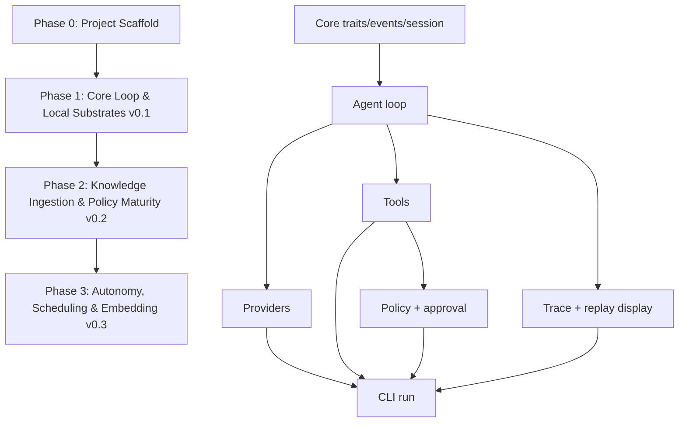

## gestalt-harness Implementation Roadmap

**Status:** Draft  
**Created:** 2026-05-31  
**Source documents:** [gestalt-harness-prd.md](gestalt-harness-prd.md), [gestalt-harness-architecture.md](gestalt-harness-architecture.md)  
**Purpose:** Give engineers a shared, phase-by-phase implementation plan with explicit task dependencies, test expectations, and progress checkpoints.

> The PRD owns scope and priority. The architecture document owns runtime contracts, crate boundaries, trait shapes, and implementation decisions. When they conflict, follow the architecture document.

---

## Progress Model

Use these statuses consistently in issues, PRs, and this roadmap:

- `[ ]` Not started
- `[~]` In progress
- `[?]` Blocked or needs decision
- `[x]` Complete

Each task has:

- **Depends on:** earlier tasks or decisions required before work starts.
- **Tests:** unit, integration, CLI, fixture, or regression checks required before completion.
- **Done when:** concrete acceptance criteria for review.

Phase completion requires all tasks and phase-level verification gates to pass.

---

## Current Repository State

As of 2026-06-01, the repository contains a working Rust workspace with Phase 0 complete and most of Phase 1 implemented.

- Workspace crates, CI, fixtures, and baseline docs are in place.
- Core loop, context, tools, policy, exec, provider adapters, trace writing, replay, cost reporting, and the plain-stdout CLI path all exist.
- Remaining Phase 1 work is release hardening and any intentionally deferred UX or credential-backend work.

---

## Phase Dependency Graph

---

## Phase 0: Project Scaffold

**Goal:** Establish a working Rust workspace, shared engineering baseline, and empty crate structure that matches the architecture document.

**Exit criteria:** `cargo test --workspace`, `cargo fmt --check`, and `cargo clippy --workspace --all-targets -- -D warnings` run successfully against the scaffold.

### P0.1 Workspace Skeleton

- [x] Create root `Cargo.toml` with workspace members.
- [x] Add crates matching the architecture:
  - `gestalt-core`
  - `gestalt-cli`
  - `gestalt-models`
  - `gestalt-tools`
  - `gestalt-exec`
  - `gestalt-policy`
  - `gestalt-context`
  - `gestalt-trace`
  - `gestalt-docs`
  - `gestalt-index`
  - `gestalt-memory`
  - `gestalt-mcp`
- [x] Configure shared package metadata: license, edition, repository, authors, rust-version.
- [x] Add feature flags for deferred capabilities: `pdf`, `mcp`, `tui`, `otel`, `wasm`.

**Depends on:** PRD §21, architecture §4.1-§4.3.  
**Tests:** `cargo metadata`, `cargo check --workspace`.  
**Done when:** all crates compile as empty or minimal libraries/binaries and dependency directions match architecture ADR-001.

### P0.2 Tooling Baseline

- [x] Add rustfmt configuration if project-specific formatting rules are needed.
- [x] Add clippy expectations and deny warnings in CI.
- [x] Add `.gitignore` for `target/`, run logs, local env files, editor state, and generated artifacts.
- [x] Add `README.md` with project status, source docs, and local development commands.
- [x] Add `CONTRIBUTING.md` with workflow, test gates, dependency-budget rule, and safety expectations.

**Depends on:** P0.1.  
**Tests:** `cargo fmt --check`, `cargo clippy --workspace --all-targets -- -D warnings`.  
**Done when:** a new engineer can clone the repo, run the documented checks, and understand that implementation has not yet shipped.

### P0.3 CI Pipeline

- [x] Add CI job for format, clippy, workspace tests, and workspace check.
- [x] Cache Cargo registry/build artifacts where appropriate.
- [x] Ensure CI uses stable Rust compatible with the chosen `rust-version`.
- [x] Add a separate feature matrix job for default features and all features once feature-gated crates contain code.

**Depends on:** P0.1, P0.2.  
**Tests:** CI passes on an empty implementation PR.  
**Done when:** every PR receives automated pass/fail status for the minimum quality gate.

### P0.4 Architecture Guardrails

- [x] Document crate dependency rules in `CONTRIBUTING.md`.
- [x] Add a lightweight dependency audit script or CI check that prevents `gestalt-core` from depending on concrete crates.
- [x] Add initial crate-level docs explaining each crate's ownership boundary.
- [x] Add ADR index or link to architecture ADRs.

**Depends on:** P0.1.  
**Tests:** dependency graph check verifies `gestalt-core` is not dependent on implementation crates.  
**Done when:** reviewers have a mechanical way to catch dependency inversion regressions.

### P0.5 Test Fixtures Layout

- [x] Create `tests/fixtures/` for provider streams, policy files, trace logs, sample workspaces, sample source documents, and CLI golden output.
- [x] Add sample `.gestalt/config.toml`, `.gestalt/policies.toml`, `workspace.md`, and `memory.md` fixtures.
- [x] Add a convention for redacted provider HTTP cassettes once provider adapters are implemented.

**Depends on:** P0.1.  
**Tests:** fixture paths are referenced by one smoke test so CI catches accidental deletion.  
**Done when:** Phase 1 tasks can add focused tests without inventing new fixture structure.

---

## Phase 1: Core Loop & Local Substrates (v0.1)

**Goal:** Ship a usable, safe single-agent CLI loop with minimal policy gating, local tools, provider streaming, JSONL trace, and display replay.

**Not in scope:** PDF tool, MCP client, pipeline mode, skills, vector index, TUI, WASM.

**Exit criteria:** `cargo install gestalt-harness` produces a working `gestalt` binary for Linux and macOS; CI runs without live API keys; mock-provider integration tests cover the full tool loop.

### P1.1 `gestalt-core` Domain Contracts

- [x] Implement `Message`, `ContentBlock`, `ContentTrust`, image/document source types.
- [x] Implement `AgentEvent`, `PolicyStatus`, `StopReason`, `VerificationStatus`.
- [x] Implement `Session`, `SessionConfig`, `ExecutionMode`, `RunResult`, and token budget types.
- [x] Implement `Provider`, `ProviderRequest`, `ProviderCapabilities`, and `EventStream`.
- [x] Implement `Tool`, `ToolContext`, `ToolOutput`, `ToolExecutionResult`, `ToolArtifact`, `RiskLevel`.
- [x] Implement `PolicyEngine`, `PolicyRequest`, `PolicyDecision`.
- [x] Implement `ApprovalProvider`, approval request/decision types, test approval providers.
- [x] Implement `HarnessError` taxonomy with typed provider/tool/policy/context/trace errors.
- [x] Keep `gestalt-core` pure: no file I/O, no HTTP, no concrete tools/providers.

**Depends on:** Phase 0.  
**Tests:** serialization round trips for messages/events/results; compile-time checks for trait object safety; error display/source tests.  
**Done when:** concrete crates can depend on core contracts without circular dependencies.

### P1.2 Full-Turn Agent Loop

- [x] Implement `TurnAccumulator` so text, thinking, and streamed tool calls are collected before execution.
- [x] Append the full assistant turn to session history before appending tool results.
- [x] Evaluate policy for every proposed tool call using `PolicyRequest`.
- [x] Route confirm decisions through injected `ApprovalProvider`.
- [x] Execute denied calls as error tool results.
- [x] Execute read-only low-risk calls in parallel only when safe; execute writes/network calls sequentially.
- [x] Preserve original tool-call order when appending results.
- [x] Emit events for context build, model request, policy decision, tool result, usage, stop, and recoverable errors.
- [x] Keep `gestalt-core/src/agent.rs` under the architecture's 200-line target by pushing mechanics into helpers.

**Depends on:** P1.1.  
**Tests:** mock provider tests for text-only turn, single tool call, multiple tool calls, denied call, confirm call, max-turn stop, budget-exhausted stop, and tool result ordering.  
**Done when:** the state machine invariants in architecture §5 are enforced by tests.

### P1.3 Minimal Context Pipeline

- [x] Implement deterministic `ContextPipeline` trait implementation in `gestalt-context`.
- [x] Load current history into provider-ready messages.
- [x] Add basic `workspace.md` and `memory.md` injection hooks for CLI composition.
- [x] Add token budget accounting and explicit budget-exhaustion behavior.
- [x] Add trust boundary rendering for untrusted content, even if Phase 1 has few untrusted source types.
- [x] Record context pipeline version for trace/replay compatibility.

**Depends on:** P1.1.  
**Tests:** deterministic output for same inputs; priority trimming behavior; trust boundary rendering snapshot tests; token budget exhaustion tests.  
**Done when:** provider requests are repeatable and never silently include untrusted content as trusted instructions.

### P1.4 Tool Registry and Built-In Local Tools

- [x] Implement `ToolRegistry` with registration, schema listing, lookup, and execution.
- [x] Implement `ReadTool` with path validation, line ranges, encoding handling, and token/output limits.
- [x] Implement `SearchTool` using fast local search semantics.
- [x] Implement `WriteTool` with full replacement, parent directory creation, and diff preview support.
- [x] Implement `PatchTool` for unified diff application.
- [x] Implement `BashTool` as fresh subprocess execution.
- [x] Implement `WebFetchTool` with HTTP/HTTPS-only fetch, response size cap, redirect recording, readability extraction, and untrusted output tagging.
- [x] Derive JSON Schema for all tool inputs via `schemars`.

**Depends on:** P1.1, P1.6 for subprocess execution. Coordinate with P1.5 for shared path, risk, and policy integration.  
**Tests:** schema snapshot tests; path traversal rejection; symlink escape rejection; read line ranges; write diff; patch success/failure; bash timeout/output cap; web SSRF/private IP/scheme rejection; truncation artifact behavior.  
**Done when:** all Phase 1 tools are policy-aware and safe by default.

### P1.5 Minimal Policy and Approval

- [x] Parse `.gestalt/policies.toml` with minimal path, network, and bash sections.
- [x] Implement layered default policy behavior for `confirm`, `yolo`, `human`, `dry-run`, and `replay`.
- [x] Implement bash risk classifier from PRD §10.3.
- [x] Enforce read/write allow and deny path lists.
- [x] Deny secret/env paths by default.
- [x] Implement policy source reporting for trace audit.
- [x] Implement CLI approval provider with approve, deny, edit, and always-allow-for-session.

**Depends on:** P1.1. Coordinate with P1.4 for tool-specific risk classification and path extraction.  
**Tests:** policy matrix tests; bash classifier tests; allow/deny precedence; mode routing; session-scoped approval; invalid policy file diagnostics.  
**Done when:** no tool can execute without a logged policy decision.

### P1.6 `gestalt-exec` NoSandbox

- [x] Implement direct subprocess runner with working directory restriction.
- [x] Enforce timeout.
- [x] Enforce stdout/stderr output cap.
- [x] Pass only allowlisted environment variables.
- [x] Normalize exit status, stderr, stdout, timeout, and truncation into tool output.

**Depends on:** P1.1, P1.5.  
**Tests:** command success/failure; timeout kill; output cap; environment redaction; working-dir restriction.  
**Done when:** `BashTool` has no direct process-management code beyond calling the execution abstraction.

### P1.7 Provider Adapters and Model Catalog

- [x] Implement provider registry with lazy factory registration, taking config and returning a provider or typed error.
- [x] Implement Anthropic, OpenAI, and OpenAI-compatible SSE adapters.
- [x] Normalize provider streams into normalized events (TextDelta, ThinkingDelta, ToolCallProposed, Usage, and Stop).
- [x] Implement stateful tool call accumulation in `TurnAccumulator::push` matching architecture §11.8.
- [x] Implement model catalog with `ModelInfo`, `ModelInfoSource`, and layered resolution support.
- [x] Implement credentials resolution boundary separate from behavioral config for v0.1, with environment-variable resolution shipping now and keychain/vault/session backends deferred.
- [x] Implement v0.1 diagnostics commands: `auth resolve`, `models list/inspect/refresh/select`, and `providers list/inspect/test/doctor`.
- [x] Ensure CI uses recorded fixtures only; no live API keys.

**Depends on:** P1.1, P1.2.  
**Tests:** recorded-stream normalization fixtures, no-secret logging assertions, auth redaction checks, and catalog resolution tests.  
**Done when:** Anthropic, OpenAI, and OpenAI-compatible adapters can drive the loop, credentials resolve separately from provider behavior, and the shipped auth/model/provider diagnostics function without live API keys.

### P1.8 Trace, Cost, and Display Replay

- [x] Implement `TraceSink` trait usage in the loop composition path.
- [x] Implement `JsonlTraceSink` with `EventEnvelope`, schema version, session id, turn id, seq, timestamp, redacted flag.
- [x] Add redaction pass for provider keys, JWTs, connection strings, and known secret patterns.
- [x] Write run directory structure with `trace.jsonl`, `summary.md`, `cost.json`, and `artifacts/`.
- [x] Implement `gestalt replay --mode display`.
- [x] Implement `gestalt cost` over one run or run directory.

**Depends on:** P1.1, P1.2, P1.7.  
**Tests:** JSONL schema round trip; monotonic sequence numbers; redaction tests; replay display golden output; cost aggregation fixture tests.  
**Done when:** a completed or failed session is inspectable without provider calls or tool execution.

### P1.9 CLI Composition Root

- [x] Implement `gestalt run`.
- [x] Implement `gestalt replay`.
- [x] Implement `gestalt cost`.
- [x] Implement `gestalt config validate`.
- [x] Implement `--workspace`, `--mode`, `--model`, and `--max-turns`; plain stdout is the only v0.1 UI path, so `--no-tui` remains unnecessary until a TUI exists.
- [x] Resolve config hierarchy: CLI flags, environment, workspace config, global config, defaults.
- [x] Compose provider, context pipeline, tools, policy, approval provider, and trace sink.
- [x] Use plain stdout mode for v0.1.

**Depends on:** P1.3, P1.4, P1.5, P1.7, P1.8.  
**Tests:** replay/cost golden tests, config precedence tests, missing credential diagnostics, invalid workspace diagnostics, and fixture smoke coverage.  
**Done when:** local users can run a safe one-shot task and replay the resulting trace.

### P1.10 v0.1 Release Hardening

- [x] Add installation test for `cargo install --path crates/gestalt-cli` or equivalent package layout.
- [x] Validate Linux and macOS CI targets.
- [x] Audit default feature binary size against the under-10 MB stripped target where feasible.
- [x] Audit direct dependency count per crate against architecture §4.3.
- [x] Add release checklist and changelog entry.

**Depends on:** P1.1-P1.9.  
**Tests:** workspace test suite, clippy, fmt, install smoke, dependency audit, recorded-provider suite.  
**Done when:** v0.1 is safe and usable for local single-agent sessions.

---

## Phase 2: Knowledge Ingestion & Policy Maturity (v0.2)

**Goal:** Add knowledge-work capabilities: document ingestion, MCP, memory, lexical indexing, citation verification, additional providers, deterministic replay, and skills.

**Exit criteria:** a knowledge-mode session can ingest text PDFs/HTML/Markdown, cite indexed chunks, use MCP tools under policy, propose memory updates, and deterministic replay local tool calls.

### P2.1 Full Policy Grammar and Approval UX

- [ ] Complete `policies.toml` grammar for paths, tools, bash, network, MCP, and skill permissions.
- [ ] Add policy explain output for why a decision happened.
- [ ] Support MCP namespace/server/tool-level policy matching.
- [ ] Support skill permission enforcement through the same policy engine.
- [ ] Improve approval UX for diffs, network calls, MCP calls, and skill-triggered calls.

**Depends on:** P1.5, P1.9.  
**Tests:** grammar parsing fixtures; policy precedence matrix; MCP policy matching; skill permission enforcement; approval edit flow.  
**Done when:** policy decisions are deterministic, explainable, and broad enough for all v0.2 capabilities.

### P2.2 Document Extraction and Source Cache

- [ ] Implement `gestalt-docs` Markdown chunking.
- [ ] Implement HTML readability extraction as reusable document extraction.
- [ ] Implement text-based PDF extraction behind `pdf` feature using `pdfium-render`.
- [ ] Implement source metadata capture: source hash, URI/path, title, page/byte ranges, extraction backend.
- [ ] Implement `.gestalt/source-cache/<content-hash>/` structure with `meta.json`, `summary.md`, `chunks.jsonl`, `manifest.json`.
- [ ] Implement `PdfTool` and `IngestDocTool`.

**Depends on:** P1.3, P1.4, P1.8.  
**Tests:** markdown chunk fixture tests; HTML extraction snapshots; PDF fixture page extraction; cache manifest round trips; source hash stability; oversized file behavior.  
**Done when:** ingested sources are reusable across sessions and preserve citation-grade metadata.

### P2.3 Lexical Workspace Index

- [ ] Implement `gestalt-index` lexical index using BM25 and/or ripgrep-backed search.
- [ ] Index workspace files, `/sources/`, `/docs/`, and source-cache chunks.
- [ ] Add source summary lookup.
- [ ] Integrate index results into context ranking.
- [ ] Expose index/search behavior through existing `SearchTool` where appropriate.

**Depends on:** P2.2, P1.3.  
**Tests:** ranking fixture tests; deterministic ordering; ignored-path tests; source-cache search tests; no hidden vector DB requirement.  
**Done when:** knowledge-mode context can locate relevant source chunks without loading entire documents.

### P2.4 Memory System

- [ ] Implement `memory.md` parser.
- [ ] Inject approved memory facts as low-priority context.
- [ ] Generate memory proposals at session end.
- [ ] Deduplicate proposals against existing memory.
- [ ] Require user approval before writing memory.
- [ ] Log memory proposal diffs as trace events.

**Depends on:** P1.3, P1.8, P2.1.  
**Tests:** parser fixtures; deduplication tests; proposal diff snapshots; approval-required write test; trace event assertion.  
**Done when:** memory remains human-readable and no memory write can happen silently.

### P2.5 MCP Client

- [ ] Implement MCP stdio transport.
- [ ] Implement MCP HTTP SSE transport.
- [ ] Implement capability negotiation.
- [ ] Register MCP tools into `ToolRegistry` using `mcp:<server_name>:<tool_name>` names.
- [ ] Tag MCP tool results as untrusted.
- [ ] Restrict MCP roots to workspace root.
- [ ] Disable MCP sampling by default.
- [ ] Add `gestalt mcp` inspection/config commands as needed.

**Depends on:** P1.4, P2.1, P1.3.  
**Tests:** fake MCP server fixtures; stdio dispatch; SSE dispatch; namespace policy tests; roots restriction; sampling disabled by default; untrusted-result rendering.  
**Done when:** MCP tools are operational but never trusted or permissionless by default.

### P2.6 Additional Providers

- [ ] Add Mistral provider adapter.
- [ ] Add Groq provider adapter.
- [ ] Add Ollama provider adapter.
- [ ] Extend provider catalog and capability metadata.
- [ ] Add provider-specific config validation.

**Depends on:** P1.7.  
**Tests:** recorded stream normalization for each provider; local Ollama mock or fixture mode; provider registry tests; no live keys in CI.  
**Done when:** new providers satisfy the same event stream contract as Phase 1 providers.

### P2.7 Citation Contract and Verification

- [ ] Implement citation metadata events in trace.
- [ ] Render citations as `[^SourceID:PageRef-ChunkID]`.
- [ ] Implement `CitationVerifier`.
- [ ] Verify every research citation maps to an indexed source chunk and hash.
- [ ] Report unverifiable citations as verification findings.
- [ ] Integrate verification results into trace and CLI output.

**Depends on:** P2.2, P2.3, P1.8.  
**Tests:** valid citation fixture; missing source fixture; wrong chunk fixture; changed hash fixture; Markdown citation parsing; verification report serialization.  
**Done when:** factual research outputs can be audited against source chunks.

### P2.8 Skill System

- [ ] Implement SKILL.md front matter parser.
- [ ] Load only skill name and description at startup.
- [ ] Activate full skill body on trigger or explicit `/skill`.
- [ ] Support deep fetching of `references/` and `scripts/` through normal tools and policy.
- [ ] Enforce skill permissions: tools, network, write paths, scripts, token budget.
- [ ] Implement `gestalt skill list` and `gestalt skill validate`.
- [ ] Track skill trust level; only workspace-local skills auto-activate.
- [ ] Keep the harness responsible for skill loading, trust, and policy enforcement only; domain-specific workflow skills stay outside the core runtime.

**Depends on:** P2.1, P1.3, P1.9.  
**Tests:** front matter fixtures; startup discovery token budget test; trigger matching; permission enforcement; validation diagnostics; untrusted skill activation behavior.  
**Done when:** skills improve procedure reuse without bypassing policy or context trust boundaries.

### P2.9 Deterministic Replay

- [ ] Implement `gestalt replay --mode deterministic`.
- [ ] Re-run local tool calls from trace.
- [ ] Compare outputs to recorded tool results.
- [ ] Require matching context pipeline and tokenizer versions where relevant.
- [ ] Report replay drift with useful diffs.

**Depends on:** P1.8, P1.4, P2.2 for document tools.  
**Tests:** replay success fixture; replay drift fixture; missing artifact fixture; version mismatch fixture; no provider calls.  
**Done when:** local tool behavior can be regression-tested from recorded traces.

### P2.10 v0.2 Knowledge-Mode Release Hardening

- [ ] Add end-to-end knowledge-mode scenario using mock provider and document fixtures.
- [ ] Verify citation contract over generated fixture output.
- [ ] Audit untrusted content rendering for web, PDF, MCP, and retrieved chunks.
- [ ] Re-run dependency budget audit with feature flags.
- [ ] Update README and release notes.

**Depends on:** P2.1-P2.9.  
**Tests:** complete v0.2 suite with `--features pdf,mcp`; deterministic replay suite; citation verifier suite.  
**Done when:** knowledge-work features are auditable and safe enough for regular local use.

---

## Phase 3: Pipelines, Resumability & Embedding (v0.3)

**Goal:** Add repeatable pipelines, resumability, bounded delegation, stronger sandbox options, export formats, optional observability, WASM embedding, and regression replay. Keep workflow strategy, scheduling, and domain-specific templates outside the harness boundary.

**Exit criteria:** users can run generic Markdown pipelines, resume interrupted sessions, spawn bounded sub-agents, use stronger sandbox backends, export ShareGPT data, and run regression replay checks.

### P3.1 Pipeline Mode

- [ ] Define executable semantics for Markdown pipeline files.
- [ ] Implement sequential pipeline step parser.
- [ ] Support task, verify, write, and human-approval step types if structured blocks are selected.
- [ ] Run each step with trace continuity.
- [ ] Generate run diffs between pipeline executions.
- [ ] Add `gestalt pipeline --file`.
- [ ] Keep pipeline semantics generic; domain-specific workflow templates and scheduling logic live around the harness, not inside it.

**Depends on:** P1.9, P2.7, P2.9.  
**Tests:** parser fixtures; sequential execution with mock provider; human approval step; failed verification stops or repairs according to policy; run diff snapshots.  
**Done when:** teams can run repeatable research or coding workflows from versioned Markdown.

### P3.2 Session Resumability

- [ ] Resume partial sessions from `.gestalt/runs/.../trace.jsonl`.
- [ ] Reconstruct session history, tool context, token budget, and active sources.
- [ ] Support continuing interrupted runs without re-executing completed side effects.
- [ ] Validate trace compatibility before resumption.

**Depends on:** P1.8, P2.9.  
**Tests:** interrupted trace fixture; resume after tool call; resume after model stop; incompatible version diagnostics; duplicate side-effect prevention.  
**Done when:** interrupted work can continue safely and auditably.

### P3.3 Sub-Agent Spawning

- [ ] Implement bounded child `AgentLoop` sessions as a tool.
- [ ] Restrict child `ToolContext`, token budget, tools, and write paths.
- [ ] Forward child events to parent trace with correlation metadata.
- [ ] Return summarized child result to parent history.
- [ ] Prevent recursive unbounded spawning.
- [ ] Keep delegation bounded and explicit; do not turn child loops into a general multi-agent planning topology.

**Depends on:** P1.2, P1.5, P1.8, P2.1.  
**Tests:** child loop fixture; restricted tool access; trace correlation; recursion limit; child failure propagation.  
**Done when:** delegation exists but remains bounded by explicit policy and context limits.

### P3.4 Stronger Sandbox Backends

- [ ] Implement `ExecutionSandbox` trait if not already introduced.
- [ ] Implement `WorkspaceSandbox` improvements over `NoSandbox`.
- [ ] Implement `BubblewrapSandbox` behind feature flag for Linux.
- [ ] Implement `DockerSandbox` behind feature flag for cross-platform isolation.
- [ ] Add sandbox selection through config.
- [ ] Preserve timeout, output cap, env allowlist, mount, and network policy semantics across backends.

**Depends on:** P1.6, P2.1.  
**Tests:** backend contract tests; network policy tests; mount restriction tests; missing backend diagnostics; Linux bubblewrap CI where available; Docker tests optional or nightly/manual if CI lacks daemon.  
**Done when:** users can opt into stronger isolation without changing tool behavior.

### P3.5 Export and Fine-Tuning Data

- [ ] Implement `gestalt export --format markdown`.
- [ ] Implement `gestalt export --format jsonl`.
- [ ] Implement `gestalt export --format sharegpt`.
- [ ] Ensure redaction is applied before export.
- [ ] Include citation and verification metadata where format permits.

**Depends on:** P1.8, P2.7.  
**Tests:** export golden files; redaction assertions; invalid trace diagnostics; ShareGPT schema validation.  
**Done when:** run data can be inspected, shared, or used for fine-tuning workflows safely.

### P3.6 Optional OpenTelemetry

- [ ] Add optional `otel` feature.
- [ ] Emit spans for provider calls, context compilation, policy evaluation, tool execution, and verification.
- [ ] Keep telemetry local/off by default.
- [ ] Ensure no prompts, secrets, or raw tool outputs are exported as span attributes by default.

**Depends on:** P1.8.  
**Tests:** feature-gated compile; span shape tests with in-memory exporter; secret redaction tests.  
**Done when:** runtime debugging is available without adding telemetry to the default binary.

### P3.7 WASM Build Target

- [ ] Identify crates that can compile to WASM.
- [ ] Gate or replace non-WASM-compatible dependencies.
- [ ] Replace provider HTTP client implementation with fetch-compatible bindings where needed.
- [ ] Preserve core traits and context logic for embedding in a frontend.
- [ ] Document unsupported tools in WASM mode.

**Depends on:** P1.1, P1.3, P1.7.  
**Tests:** `wasm32-unknown-unknown` or chosen target check for supported crates; wasm feature compile test; no accidental native-only dependency in core/context.  
**Done when:** embedders can reuse the harness core without the CLI/native tool stack.

### P3.8 Programmatic Tool Calling

- [ ] Add `allowed_callers` metadata to tool definitions.
- [ ] Support Anthropic `code_execution` tool-calling flow where enabled.
- [ ] Route mid-execution tool calls through normal policy and trace paths.
- [ ] Mark caller as `direct` or `code_execution` in trace.
- [ ] Restrict this capability to safe tools by default.

**Depends on:** P1.2, P1.4, P1.7, P2.1.  
**Tests:** recorded provider fixture with programmatic tool calls; disallowed caller test; trace caller metadata; policy enforcement from code-execution context.  
**Done when:** data-heavy workflows can use programmatic tool calls without bypassing policy.

### P3.9 Regression Replay

- [ ] Implement `gestalt replay --mode regression`.
- [ ] Re-run model and tools where explicitly requested.
- [ ] Compare semantic invariants rather than exact model text.
- [ ] Integrate verifier suite for code, research, data, and architecture outputs.
- [ ] Generate regression reports.

**Depends on:** P2.7, P2.9, P3.5.  
**Tests:** regression fixture with mock provider; invariant pass/fail reports; provider-disabled diagnostics; repair-turn behavior where supported.  
**Done when:** teams can use traces as durable end-to-end quality checks.

### P3.10 Community Skill Registry

- [ ] Implement `gestalt skill fetch <name>`.
- [ ] Store downloaded skills as untrusted until reviewed.
- [ ] Validate signatures where available.
- [ ] Add review/accept flow before automatic activation.
- [ ] Enforce registry skills through the same skill permission model.

**Depends on:** P2.8, P2.1, P3.5 for export/reporting support if needed.  
**Tests:** registry client fixture; signature validation; untrusted activation denial; accepted skill activation; policy enforcement.  
**Done when:** external skills are usable without weakening local trust rules.

### P3.11 Remote Task Execution Stub

- [ ] Define remote execution interfaces without shipping a hosted service.
- [ ] Keep `ToolContext`, `TraceSink`, and `ApprovalProvider` remappable for remote paths/channels.
- [ ] Add no-op or local-only stub implementation for future deployment compatibility.
- [ ] Document non-goals and unsupported production topology.

**Depends on:** P1.1, P1.8, P3.1.  
**Tests:** compile-only interface tests; local stub behavior; docs check.  
**Done when:** future remote deployment is not blocked by local-only type assumptions.

### P3.12 v0.3 Release Hardening

- [ ] Add end-to-end pipeline scenario.
- [ ] Add resume scenario.
- [ ] Add sandbox backend scenario where available.
- [ ] Add regression replay scenario.
- [ ] Audit binary size with default features.
- [ ] Update docs, changelog, and release checklist.

**Depends on:** P3.1-P3.11.  
**Tests:** default suite; all-features suite; platform-specific sandbox suite; wasm compile suite; regression replay suite.  
**Done when:** v0.3 features are feature-gated, documented, and do not compromise v0.1/v0.2 safety guarantees.

---

## Cross-Phase Engineering Rules

- Keep `gestalt-core` free of concrete I/O, HTTP clients, provider SDKs, filesystem writes, and implementation crates.
- Never execute a tool without a `PolicyDecision` event.
- Treat external content as untrusted: web, PDF, MCP, retrieved chunks, and downloaded skills.
- Keep trace events as the source of truth for UI, replay, cost, verification, and exports.
- Keep workflow strategy, scheduling, multi-agent orchestration, and domain-specific templates outside the harness.
- Do not add dependencies to a crate without checking the dependency budget in architecture §4.3.
- Do not introduce live provider calls in CI. Use recorded fixtures and mock providers.
- Do not store provider API keys or secrets in config, traces, fixtures, or exports.
- Prefer feature gates for optional/heavy capabilities.

---

## Phase-Level Verification Gates

| Phase | Required Gates |
|---|---|
| Phase 0 | Workspace compiles, fmt passes, clippy passes, CI active, dependency direction guard exists |
| Phase 1 | Mock-provider loop tests, provider fixture tests, policy matrix tests, tool safety tests, JSONL replay display tests, CLI golden tests |
| Phase 2 | Document ingestion tests, source cache tests, MCP fake-server tests, citation verifier tests, deterministic replay tests, skill permission tests |
| Phase 3 | Pipeline tests, resume tests, sandbox contract tests, export schema tests, WASM compile tests, regression replay tests |

---

## Open Decisions to Resolve Before Implementation

- **Vector index in Phase 2:** PRD leaves open whether Phase 2 remains purely lexical or introduces a lightweight vector index. Default roadmap assumption: lexical only through v0.2.
- **Pipeline step schema:** PRD leaves Markdown pipeline semantics open. Default roadmap assumption: structured YAML blocks inside Markdown for executable steps.
- **Crate packaging layout:** resolved in favor of `crates/gestalt-cli` owning the published `gestalt-harness` package and continuing to install the `gestalt` binary.
- **Provider cassette format:** choose a cassette format before implementing provider adapters.
- **Binary size measurement method:** define standard stripped binary measurement command for Linux and macOS.

---

## First Implementation Sequence

Engineers starting from the current empty repo should work in this order:

1. P0.1 Workspace Skeleton
2. P0.2 Tooling Baseline
3. P0.3 CI Pipeline
4. P0.4 Architecture Guardrails
5. P0.5 Test Fixtures Layout
6. P1.1 `gestalt-core` Domain Contracts
7. P1.2 Full-Turn Agent Loop
8. P1.5 Minimal Policy and Approval
9. P1.6 `gestalt-exec` NoSandbox
10. P1.4 Tool Registry and Built-In Local Tools
11. P1.3 Minimal Context Pipeline
12. P1.7 Provider Adapters and Model Catalog
13. P1.8 Trace, Cost, and Display Replay
14. P1.9 CLI Composition Root
15. P1.10 v0.1 Release Hardening
