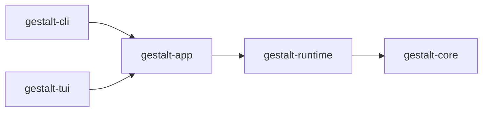
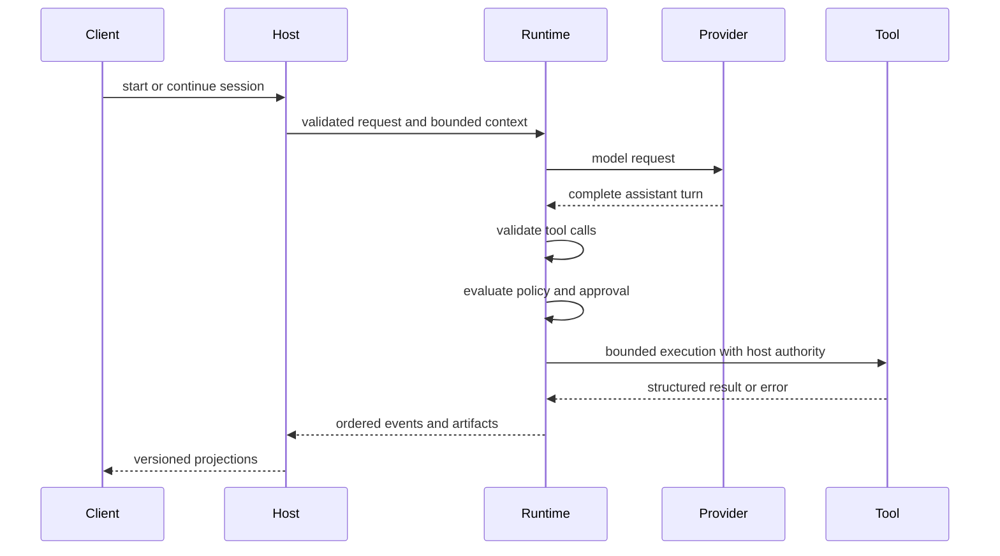

# Gestalt Harness Architecture

## Purpose

This document describes current system boundaries and execution flow. Accepted
decisions live in [ADRs](./adrs/README.md), released interfaces live in the
[v0.1 contract map](./v0.1/README.md), and implementation scope lives in the
[hardening specification](./feature-spec/v0.1-hardening.md).

## Crate Boundaries

| Crate | Owns | Does not own |
|---|---|---|
| `gestalt-core` | execution invariants, messages, events, provider/tool/policy traits, cancellation | filesystem, HTTP, process execution, presentation |
| `gestalt-runtime` | concrete composition, context assembly, tools, providers, traces, extensions, policy enforcement | product workflows and presentation |
| `gestalt-app` | reusable workspace, configuration, session, catalog, and diagnostic services | CLI/TUI rendering |
| `gestalt-cli` | command parsing, terminal rendering, process exits | reusable business logic |
| `gestalt-tui` | terminal interaction and rendering | runtime authority or persistence contracts |

`gestalt-core` remains dependency-inverted and I/O-free. See
[ADR-001](./adrs/ADR-001-inverted-crate-dependency-direction.md) and
[ADR-023](./adrs/ADR-023-runtime-composition-layer.md).

## Execution Flow

The invariant order is:

1. resolve session lineage and active run;
2. assemble bounded context;
3. collect a complete assistant turn;
4. validate tool identity and input;
5. evaluate policy and obtain approval where required;
6. execute with host-derived authority and cancellation;
7. shape bounded output and artifacts;
8. persist ordered events and update session state.

The loop does not render UI, resolve product intent, or expose internal models
as client contracts.

## Contract Boundaries

One concept may have different representations:

- internal Rust model for execution;
- persisted versioned record for replay;
- client DTO for product-neutral control and observation;
- CLI envelope for automation.

Raw `Session`, `AgentEvent`, registries, provider-native values, broadcast
receivers, absolute paths, and internal error chains are not client DTOs. The
stable surface is enumerated in the
[API/SPI inventory](./plans/v0.1-hardening/api-spi-inventory.md).

## Trust Boundaries

### Host authority

The host supplies effective filesystem, network, shell, environment, and
artifact authority. Tool and extension declarations cannot grant themselves
authority.

### External content

Provider output, web content, MCP responses, workspace documents, and extension
metadata are untrusted inputs. They are bounded, tagged, and validated before
use.

### Secrets

Configuration and persisted records contain secret references, not secret
values. Client projections and diagnostics redact internal causes and
credentials.

### Process execution

The v0.1 direct subprocess implementation is not a security sandbox. Policy and
approval remain mandatory where configured. Isolation work is deferred; see
[ADR-009](./adrs/ADR-009-sandbox-deferred-to-v02.md) and
[ADR-016](./adrs/ADR-016-honest-host-execution-nosandbox-and-network-policy-enforcement.md).

## Runtime Composition

`AgentRuntimeBuilder` combines:

- one provider;
- a tool catalog;
- context assembly;
- policy and approval providers;
- trace and artifact sinks;
- runtime modules and extension packages;
- lifecycle hooks and inspection state.

The builder returns structured errors for missing or invalid requirements.
Session-owning hosts implement the full runtime-control contract; the runtime
does not acquire product-specific session ownership.

## Extensions

Stable v0.1 accepts extension package manifest V2 and Lifecycle Protocol V2
only. Activation follows discovery, validation, launch, and initialization.
Required components fail closed; optional components produce diagnostics and do
not block startup.

Runtime generations are immutable snapshots. Each assistant turn holds a lease
to one generation; reload publishes a new generation without changing an
active turn. See [ADR-028](./adrs/ADR-028-extension-package-components.md),
[ADR-029](./adrs/ADR-029-runtime-snapshot-reload.md),
[ADR-030](./adrs/ADR-030-lifecycle-protocol-v2.md), and
[ADR-031](./adrs/ADR-031-v0-1-greenfield-compatibility-cutoff.md).

## Persistence and Replay

Events are the ground truth. Persisted traces carry stable metadata and
versioned payloads; client projections are derived from those records rather
than raw internal enums. Unsupported pre-hardening formats fail as incompatible
and are not migrated.

Context reports capture deterministic contributor inputs needed for replay.
Artifacts use logical identities and bounded reads at public boundaries.

## Failure and Cancellation

Expected input, policy, provider, tool, trace, context, and activation failures
return structured errors or reports. Library consumers are not expected to
catch panics for normal failures.

Cancellation propagates through provider streaming, approval, tools, hooks, and
persistence boundaries. Already committed events are retained, and terminal
runs are not rewritten by late cancellation.

## Decision Index

The complete status and title list is maintained in
[the ADR index](./adrs/README.md). This overview intentionally does not duplicate
ADR rationale or source-level schemas.
