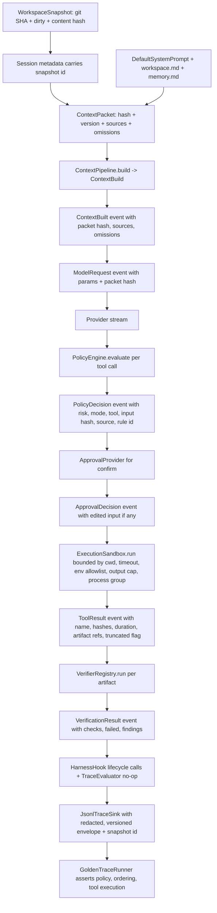

# feat: Harden v0.1 harness engineering primitives

## Summary

Tighten v0.1 around the six harness-engineering invariants — no invisible action, no unbounded action, no unaudited permission, no opaque context, no unverifiable artifact, no throwaway traces — so every model action passes through deterministic context, typed tools, policy gates, structured execution, event traces, replay, and verification. The plan also adds a workspace snapshot on session metadata, a `TraceFixture` / `GoldenTrace` regression harness with a `TraceEvaluator` future-extension point, and a default overridable system prompt. This builds on the existing P1.10 release-hardening plan (package rename, install smoke, dependency audit, binary size, CI matrix) by closing the v0.1 safety, context, verification, and observability gaps found in the v0.1 review.

## Problem Frame

Phase 1 has shipped the agent loop, provider adapters, tools, policy, exec, trace/replay, cost, and CLI composition, but a v0.1 harness-engineering review surfaced concrete gaps that weaken every primary invariant:

- Session-wide "always allow" stores only the tool name, so approving one benign `bash` call bypasses risk checks for later dangerous `bash` calls.
- `NoSandbox` is positioned as a sandbox, but the subprocess still runs on the host with no chroot, no mount namespace, and no seccomp, so cwd validation is not confinement.
- `ExecRequest.network_policy` is accepted but `NoSandbox` never enforces it; bash can perform arbitrary network I/O even when the CLI sets `allow_network: false`.
- The `bash` risk classifier is prefix/string based, so wrapped or interpreted commands become medium and are allowed in yolo mode, bypassing the secret-path protections enforced for `read` and `write`.
- `ContextBuilt` records only `packet_id` and `token_estimate`, the loop uses `session.id` as the packet id, and the rich `ContextBuild` result is discarded by the `ContextPipeline` trait — context is not inspectable or replay-ready.
- `AgentEvent::ToolResult` drops artifact, original bytes, result hash, duration, and metadata; truncated text does not spill to `artifacts/` even though the run directory is created.
- `AgentEvent::PolicyDecision` does not carry risk, mode, tool name, input summary/hash, or approval provenance.
- Verification is only an event placeholder; there is no `gestalt-verify` crate, verifier trait, or verifier registry.
- The CLI silently ignores trace emit errors, undermining "events are the ground truth."
- The `web_fetch` SSRF guard has a DNS time-of-check/time-of-use gap; subprocess timeout kills only the direct child, leaving descendants; `read`/`search` read entire files into memory before applying limits; `max_output_tokens` config is wired as bytes; `read_trace` maps open errors as write failures.

The repo will be stronger as a v0.1 harness if these are closed in the same release rather than deferred, while still keeping the surface small.

## Requirements

- R1. No tool call may execute without a logged `PolicyDecision` event that carries risk, tool name, input hash, policy source, execution mode, and the matched rule id, with policy decisions emitted even for unknown tools.
- R2. A session-scoped approval grant must be narrower than a tool name; future calls must re-run policy and the grant may only auto-approve if the new decision is no riskier than the grant, with the grant terms recorded in the trace.
- R3. `NoSandbox` must be honestly described as a host subprocess runner, not a security boundary; cwd validation, timeout enforcement, output capping, env allowlisting, process-group kill, and cancellation must all behave as documented, with the CLI defaulting bash to confirm unless the command is in a tiny audited read-only allowlist.
- R4. The harness must define and ship a `ContextPacket` result from `ContextPipeline` that contains packet hash, pipeline version, tokenizer id, sources, omissions, message hashes, and trust tags, and the loop must emit a `ContextBuilt` event with the packet hash plus sources and omissions.
- R5. `AgentEvent::PolicyDecision`, `ModelRequest`, and `ToolResult` must be expanded to include risk, tool name, input hash, policy source, decision mode, request parameters, tool name, working dir, output hash, artifact refs, and duration.
- R6. The harness must persist full truncated tool output to `artifacts/` and emit artifact path, size, MIME/type, and hash in the `ToolResult` event metadata.
- R7. A minimal `gestalt-verify` crate must ship with a `Verifier` trait, a `VerifierRegistry`, and at least the verifiers `CommandVerifier`, `FileExistsVerifier`, `NoSecretsVerifier`, `PatchAppliesVerifier`, and `MarkdownStructureVerifier`, emitting structured `VerificationResult` events.
- R8. The CLI run closure must surface trace emit failures instead of swallowing them.
- R9. `web_fetch` must close the DNS rebinding gap by validating resolved IPs and using a connector that pins them or rejects private IPs at connect time for every redirect hop.
- R10. The `bash` risk classifier must be hardened to treat interpreter wrappers and shell metacharacter-bearing commands as high-risk by default and to flag known secret-path patterns as deny candidates before falling back to the risk matrix.
- R11. Internal lifecycle hook traits must ship as Rust trait points (session, context, model, tool, artifact, verification) so v0.1 stays extensible without exposing external plugin loading yet.
- R12. Documentation must call out `NoSandbox` as host execution, document the bash default-confirm behavior, and add a `src/solutions/` or roadmap note for the harness-engineering review.
- R13. Session metadata must capture a `WorkspaceSnapshot` (git SHA when present, workspace root path, dirty flag, and a content hash of the listed tracked files) at session start and on demand, and the snapshot id must appear in trace envelopes and the run summary so traces can be correlated to a specific workspace state.
- R14. The repository must define a `TraceFixture` and `GoldenTrace` regression harness under `tests/fixtures/traces/` so `cargo test` can assert policy decisions, event ordering, and tool execution are unchanged without making any model call, with a `GoldenTraceRunner` shipping as the v0.1 implementation and a `TraceEvaluator` trait shipped as a future-extension point.
- R15. `gestalt-context` must ship a small default system prompt (identity, environment, tool-use policy, output rules) injected ahead of `workspace.md` and `memory.md`, and the default prompt must be overridable from `.gestalt/policies.toml` or a workspace file so users can replace it without forking core.

## Scope Boundaries

- Do not add real sandbox backends (bubblewrap, Docker, Firejail). The plan defines and stabilizes the `ExecutionSandbox` trait and adds an honest `NoSandbox`, but no concrete sandboxed implementation lands in v0.1.
- Do not add PDF ingestion, MCP, TUI, vector index, external plugin loading, or multi-agent orchestration in v0.1.
- Do not implement deterministic replay in v0.1; display replay remains the only replay mode. The plan only adds the metadata that future deterministic replay will need.
- Do not publish to crates.io or add release automation; that remains the related release-hardening plan.
- Do not change the public package name or binary name; that is owned by the related release-hardening plan.
- Do not introduce a separate secret/credential back-end; environment-variable resolution stays the v0.1 default.

### Deferred to Follow-Up Work

- Real sandbox backends (bubblewrap, Docker, Firejail): future v0.2 work after the trait is stable.
- Deterministic replay mode: future work that consumes the metadata added in this plan.
- Citation verification: v0.2 verifier per the roadmap.
- External plugin / MCP lifecycle hooks: v0.2+ once internal hooks prove out.
- Streaming UI / TUI hook points: v0.3+ once the core event substrate is durable.
- Full eval harness with LLM-as-judge: future work. The v0.1 plan only ships the `TraceEvaluator` trait and a no-op default so the eval hook is in place, not a real evaluator.

## Context & Research

### Relevant Code and Patterns

- `crates/gestalt-core/src/agent/executor.rs:61` — session approval stores only the tool name in `allowed_session_tools`, the grant is too broad.
- `crates/gestalt-core/src/agent/executor.rs:163` — `AlwaysAllowForSession` short-circuits policy for any future call with the same tool name.
- `crates/gestalt-exec/src/lib.rs:35`, `crates/gestalt-exec/src/lib.rs:86`, `crates/gestalt-exec/src/lib.rs:94` — `ExecRequest` accepts `network_policy` and `mounts`, but `NoSandbox` ignores them and spawns the host process with `kill_on_drop(true)` only on the direct child.
- `crates/gestalt-tools/src/tools.rs:314`, `crates/gestalt-tools/src/tools.rs:318` — `BashTool` validates cwd then spawns host `bash -lc` with the supplied env, and `network_policy: NetworkPolicy::None` is never enforced.
- `crates/gestalt-tools/src/path.rs:100` and `crates/gestalt-policy/src/lib.rs:424` — file tools reject `.env`/key/PEM paths but the bash risk classifier is string/prefix based, so `cat .env.local`, `python -c "..."`, and similar wrappers can read secrets.
- `crates/gestalt-core/src/event.rs:10` — `ContextBuilt` only has `packet_id` and `token_estimate`.
- `crates/gestalt-core/src/agent.rs:121` — `packet_id` is set to `session.id` instead of a deterministic packet hash.
- `crates/gestalt-context/src/lib.rs:20` — `ContextBuild` carries dropped count, version, and budget exhaustion, but `crates/gestalt-core/src/context.rs:3` defines `ContextPipeline::process -> Vec<Message>`, dropping the rich result.
- `crates/gestalt-core/src/tool.rs:86` — truncation just drops content; `crates/gestalt-core/src/tool.rs:138` advertises a "full output saved to artifact" notice that has no artifact.
- `crates/gestalt-core/src/event.rs:34` and `crates/gestalt-core/src/event.rs:40` — `PolicyDecision` lacks risk/mode/tool name/input hash; `ToolResult` lacks tool name/duration/working dir/artifact hash.
- `crates/gestalt-cli/src/run.rs:72` — trace emit errors are swallowed inside the run closure.
- `crates/gestalt-tools/src/tools.rs:765` — `web_fetch` resolves and validates IPs, then `reqwest` resolves again, allowing DNS rebinding.
- `Cargo.toml:3` and `crates/gestalt-core/src/event.rs:49` — verification is only an event placeholder; no `gestalt-verify` crate exists yet.
- `tests/fixtures/workspaces/minimal/.gestalt/` already provides the credential-free fixture workspace used by `gestalt config validate` smoke checks.

### Institutional Learnings

- No `docs/solutions/` learnings exist in this repository yet. The plan records its first one at the end as a note for the team.

### External References

- `awesome-harness-engineering` frames harness engineering around context engineering, evaluation, observability, orchestration, safe autonomy, and software architecture; the v0.1 invariants in this plan mirror that framing.
- The harness-engineering community reference for context compiling and trust-boundary rendering supports shipping a deterministic text/Markdown context compiler before PDF ingestion.
- The Learn-Harness-Engineering lecture on failure attribution reinforces shipping a minimal verifier substrate in v0.1 rather than blaming the model alone.

## Key Technical Decisions

- Treat session approval grants as bounded objects (tool name, input hash, risk ceiling, matched rule, expiry) rather than tool-name keys; always re-run policy and only auto-approve when the new decision is no riskier than the grant.
- Position `NoSandbox` as "host execution" with explicit documentation and CLI warnings; default bash to confirm in yolo unless the command is in a tiny audited read-only allowlist; do not pretend cwd validation is confinement.
- Make `ExecRequest.network_policy` an enforced contract in `NoSandbox` by either routing the sandboxed variant or failing closed when `None` is requested and the command is not provably local; track policy-violation events for unconfined subprocesses.
- Run `bash` as its own process group on Unix and kill the group on timeout and on `Drop`; continue draining capped stdout/stderr so commands that exceed the cap still finish promptly.
- Add a deterministic `ContextPacket` to the `ContextPipeline` trait; compute a stable hash over canonical serialized provider messages; record packet hash, sources, omissions, trust tags, and version on `ContextBuilt`; do not break the existing `process -> Vec<Message>` flow, but make the rich result the canonical output.
- Expand the public event schema with risk, mode, tool name, input hash, output hash, artifact refs, duration, working dir, and approval provenance; keep the event schema versioned and additive so old traces still parse.
- Persist full truncated tool output to `.gestalt/runs/<id>/artifacts/` and include artifact path, size, MIME/type, and `sha256` in the `ToolResult` event.
- Add a minimal `gestalt-verify` crate with `Verifier`, `VerifierRegistry`, and a `VerifyContext`, and ship the five small verifiers named in R7.
- Add internal hook traits `SessionHook`, `ContextHook`, `ModelHook`, `ToolHook`, `VerificationHook`, and `TraceHook` as Rust trait points; the agent loop invokes them at clear lifecycle seams without exposing external plugin loading.
- Use a `reqwest` connector (or a small custom connector) that validates resolved IPs and rejects private IPs at connect time for every redirect hop, closing the DNS rebinding gap.

## Open Questions

### Resolved During Planning

- Whether to ship artifact spillover in v0.1: yes, the contract already advertises it; the plan just makes it real.
- Whether `gestalt-verify` is a new crate: yes, matches the architecture's "every primitive is bounded, typed, observable, replayable, verifiable" goal and gives the loop a place to register verifiers without bloating core.
- Whether the session approval bypass is acceptable: no, it is a v0.1 safety bug and must be narrowed before tagging v0.1.

### Deferred to Implementation

- Exact verifier criteria (e.g., secret regex list, Markdown structure rules): implementation will start with a small, conservative list and grow it.
- Whether `bash` should be denied entirely in a future "safe" mode: deferred to a follow-up plan once the confirm-default lands.
- Whether internal hooks become public traits or stay crate-private: implementation may choose crate-private if external plugin support is not on the v0.1 path.

## High-Level Technical Design

> *This illustrates the intended approach and is directional guidance for review, not implementation specification. The implementing agent should treat it as context, not code to reproduce.*



```text
session approval grant =
  { tool_name, input_hash, risk_ceiling, matched_rule, source, granted_at, expires_in_turns }

policy.evaluate(request) =>
  let grant = session.find_grant(request) in
  match grant with
    | Some g when g.matches(request) and request.risk <= g.risk_ceiling -> allow, source=session_grant
    | _ -> evaluate_tool_policy(request)
```

## Implementation Units

### U1. Narrow session approval grants and emit explicit approval events

**Goal:** Make `AlwaysAllowForSession` a bounded grant that re-runs policy and refuses to auto-approve riskier calls, with the grant terms recorded in the trace.

**Requirements:** R1, R2

**Dependencies:** None

**Files:**
- Modify: `crates/gestalt-core/src/agent/executor.rs`
- Modify: `crates/gestalt-core/src/event.rs`
- Modify: `crates/gestalt-core/src/approval.rs`
- Modify: `crates/gestalt-core/src/lib.rs`
- Modify: `crates/gestalt-cli/src/approval.rs`
- Test: `crates/gestalt-core/tests/phase1.rs`
- Test: `crates/gestalt-cli/tests/fixture_smoke.rs`

**Approach:**
- Replace `allowed_session_tools: HashSet<String>` in `AgentLoop` with a `Vec<SessionGrant>` field stored on the session or loop.
- Define a `SessionGrant` struct with `tool_name`, `input_hash`, `risk_ceiling`, `matched_rule`, `source`, `granted_at_turn`, and `expires_in_turns`.
- In `evaluate_policy`, when a grant exists, only auto-approve if the new request's risk is at or below the grant's risk ceiling and the input hash matches the grant's input hash (or matches a small per-tool input fingerprint family).
- Always re-run `policy.evaluate` so the trace still contains a `PolicyDecision` event with `policy_source: "session_grant"`.
- Add an `ApprovalDecision` event variant (or extend `PolicyDecision` with optional `approval_decision` and `edited_input`) that records the human decision, the original input, and any edited input.
- Update `CliApprovalProvider` to record grant terms and to refuse to grant approval to commands whose edited input is still confirm-required.

**Patterns to follow:**
- `ApprovalDecision` already in `crates/gestalt-core/src/approval.rs:20`.
- `PolicyStatus` and `PolicySource` patterns in `crates/gestalt-policy/src/lib.rs:569`.
- The existing `MockApproval` test seam in `crates/gestalt-core/tests/phase1.rs:588`.

**Test scenarios:**
- Happy path: approving a `bash` command with `AlwaysAllowForSession` and re-running the same command yields a `PolicyDecision` with `policy_source: "session_grant"` and the call still executes.
- Edge case: after approval, a `bash` command with a different input hash is denied or re-confirmed instead of auto-approved.
- Error path: after approval of a low-risk `bash` command, a critical-risk `bash` command is denied outright.
- Integration: phase1 test suite confirms the executor still routes confirm calls through approval and never bypasses policy.
- Regression: phase1 tests for `deny_all`, `confirm_all`, and `allow_all` still pass with the new grant semantics.

**Verification:**
- Phase1 integration tests prove the new grant semantics.
- Manual CLI test: approve `bash` with `printf hello`, then propose `bash rm -rf /tmp/x`, and observe a deny or re-confirm.

### U2. Promote `ContextPipeline` to a richer `ContextPacket` and emit a hashable `ContextBuilt` event

**Goal:** Make context inspectable, replay-ready, and trust-aware without breaking the existing `process` flow.

**Requirements:** R4

**Dependencies:** None

**Files:**
- Modify: `crates/gestalt-core/src/context.rs`
- Modify: `crates/gestalt-core/src/event.rs`
- Modify: `crates/gestalt-context/src/lib.rs`
- Modify: `crates/gestalt-core/src/agent.rs`
- Test: `crates/gestalt-context/src/lib.rs` (existing tests)
- Test: `crates/gestalt-core/tests/phase1.rs`

**Approach:**
- Define `ContextPacket` with `messages: Vec<Message>`, `packet_hash: String`, `pipeline_version: String`, `tokenizer_id: String`, `token_estimate: usize`, `sources: Vec<ContextSourceRef>`, `omissions: Vec<ContextOmission>`, and `message_hashes: Vec<String>`.
- Define `ContextSourceRef` with `kind`, `path_or_label`, `trust`, `token_estimate`, and `included: bool`.
- Define `ContextOmission` with `kind`, `path_or_label`, `trust`, `reason`, and `token_estimate`.
- Dropped history messages produce both a source entry (`included: false`) and an omission entry so the trace retains source-level provenance (identity, trust, path) for excluded content.
- Add `build_packet` to `ContextPipeline` while keeping `process` for back-compat; have the loop call `build_packet` and emit a richer `ContextBuilt` event.
- Compute `packet_hash` as `sha256` over the deterministic JSON serialization (`serde_json::to_string`, stable by struct field order) of the messages plus pipeline version, and `message_hashes` similarly per message.
- Increment turn id in the trace before `ContextBuilt` (moved from `ModelRequest`) so `ContextBuilt` belongs to the right turn.

**Patterns to follow:**
- `MinimalContextPipeline` already returns a `ContextBuild` struct with dropped count and version; reuse its fields and add the new ones.
- `EventEnvelope` v1 versioning in `crates/gestalt-trace/src/lib.rs:17`; new event fields must be additive.

**Test scenarios:**
- Happy path: same inputs produce the same `packet_hash` across two builds; different `workspace.md` content changes the hash.
- Edge case: history trimming records omissions and dropped source entries (`included: false`) with the right reason and source provenance.
- Error path: `ContextPipeline::build_packet` returns a deterministic `ContextPacket` for empty history.
- Integration: phase1 test suite continues to pass with the richer `ContextBuilt` event; turn ID increments correctly in trace.

**Verification:**
- Determinism test: build twice, hashes match.
- Trimming test: drop the oldest history; sources contain `included: false` entries and omissions carry `path_or_label` and `trust`.
- Trace test: `ContextBuilt` starts a new turn, subsequent `ModelRequest` stays on the same turn.
- Runtime test: agent loop emits non-empty `packet_hash`, `provider_request_hash`, `duration_ms`, `tool_name`, and `policy_source` on real execution.

### U3. Expand event schema for policy, model, and tool results

**Goal:** Make the JSONL trace a true public protocol with replay-grade metadata for policy decisions, model requests, and tool results, while keeping the schema additive.

**Requirements:** R1, R5

**Dependencies:** U2

**Files:**
- Modify: `crates/gestalt-core/src/event.rs`
- Modify: `crates/gestalt-core/src/agent.rs`
- Modify: `crates/gestalt-core/src/agent/executor.rs`
- Modify: `crates/gestalt-trace/src/lib.rs`
- Modify: `crates/gestalt-cli/src/output.rs`
- Test: `crates/gestalt-trace/tests/trace_sink_tests.rs`
- Test: `crates/gestalt-core/tests/phase1.rs`

**Approach:**
- Add fields to `PolicyDecision`: `tool_name`, `risk`, `mode`, `input_hash`, `matched_rule`.
- Add fields to `ModelRequest`: `packet_hash`, `temperature`, `max_tokens`, `provider_request_hash`.
- Add fields to `ToolResult`: `tool_name`, `working_dir`, `duration_ms`, `output_hash`, `artifact_refs`, `policy_source`.
- Add a new `ApprovalDecision` event variant carrying `tool_call_id`, `decision`, `original_input_hash`, `edited_input_hash`, and `grant_terms` (when applicable).
- Keep existing JSON fields in place; new fields default to `None`/`Null` so old traces still parse.
- Update `render_display` and `output::render_event` to show the new fields without breaking existing golden output.

**Patterns to follow:**
- Existing `AgentEvent` variants use `#[serde(tag = "type", rename_all = "snake_case")]`; new fields stay optional.
- `EventEnvelope` v1 versioning ensures we can roll forward.

**Test scenarios:**
- Happy path: each event round-trips through serde with the new fields populated.
- Edge case: a `PolicyDecision` for an unknown tool still emits a `policy_source` that explains the denial.
- Error path: an empty `ToolResult` event still serializes and deserializes cleanly.
- Regression: existing trace sink tests still pass; old fixtures still parse; phase1 suite passes.

**Verification:**
- Trace sink tests confirm envelopes serialize, redaction still works, and `seq` stays monotonic.
- Display replay test shows the new fields in user-facing output.
- Runtime test: `ContextBuilt`, `ModelRequest`, and `ToolResult` all carry non-empty metadata fields (hash, duration, source) at runtime.

### U4. Persist truncated output to artifacts and emit artifact metadata

**Goal:** Make the existing artifact spillover contract real so traces can recover, hash, and audit full tool output.

**Requirements:** R6

**Dependencies:** U3

**Files:**
- Modify: `crates/gestalt-core/src/tool.rs`
- Modify: `crates/gestalt-core/src/agent.rs`
- Modify: `crates/gestalt-core/src/agent/executor.rs`
- Modify: `crates/gestalt-trace/src/lib.rs`
- Modify: `crates/gestalt-cli/src/run.rs`
- Test: `crates/gestalt-exec/src/lib.rs` (existing tests)
- Test: `crates/gestalt-tools/src/tools.rs` (existing tests)
- Test: `crates/gestalt-trace/tests/replay_tests.rs`

**Approach:**
- Add an `artifact_dir: Option<PathBuf>` to `ToolContext` and resolve it from the run's `RunPaths::artifacts`.
- In `ToolOutput::into_execution_result`, when truncation occurs, write the full content to `artifact_dir/<id>.txt` (or `<id>.bin`), set `tool_artifact`, compute `sha256` of the full content, and store `output_hash` and `original_bytes`.
- Emit a new `ArtifactCreated` event when the artifact is written, carrying path, size, MIME/type, and hash.
- For `BashTool`, capture full stdout and stderr into the artifacts dir before applying the byte cap, and store both as a single artifact plus individual `stdout`/`stderr` artifacts.
- Plumb the artifact path through `ToolResult` event metadata (per U3) so traces and replays can locate it.

**Patterns to follow:**
- `RunPaths::artifacts` already exists in `crates/gestalt-trace/src/lib.rs:34`.
- `ToolArtifact` in `crates/gestalt-core/src/tool.rs:150`.
- The existing `truncation_notice` in `crates/gestalt-core/src/tool.rs:138` becomes a real reference to the saved artifact.

**Test scenarios:**
- Happy path: a tool result that exceeds `max_output_bytes` creates a real artifact file under the run's `artifacts/` dir and the `ToolResult` event includes the artifact path and hash.
- Edge case: a tool result that fits under the cap has no artifact file and `truncated: false`.
- Error path: a failed write to the artifacts dir surfaces as a tool error rather than a swallowed IO error.
- Integration: phase1 tests still pass; existing exec tests still cap output as before.

**Verification:**
- A test creates a large `bash` output, runs it through the harness, and asserts the artifact path exists, the hash matches, and the trace contains the `ArtifactCreated` event.

### U5. Harden `NoSandbox` honesty, network policy enforcement, process-group kill, and the bash risk classifier

**Goal:** Stop pretending `NoSandbox` is a security boundary; make its real behavior explicit, enforce `network_policy`, kill entire process groups, and treat interpreter wrappers and secret-path references as high-risk.

**Requirements:** R3, R9, R10

**Dependencies:** None

**Files:**
- Modify: `crates/gestalt-exec/src/lib.rs`
- Modify: `crates/gestalt-tools/src/tools.rs`
- Modify: `crates/gestalt-policy/src/lib.rs`
- Modify: `crates/gestalt-core/src/agent.rs`
- Modify: `crates/gestalt-cli/src/run.rs`
- Modify: `docs/gestalt-harnes-implementation-roadmap.md`
- Test: `crates/gestalt-exec/src/lib.rs` (existing tests)
- Test: `crates/gestalt-tools/src/tools.rs` (existing tests)
- Test: `crates/gestalt-policy/src/lib.rs` (existing tests)

**Approach:**
- Rename or document `NoSandbox` as "host execution" and add a doc comment that explicitly states it is not a security sandbox; update the README and roadmap with a call-out.
- In `NoSandbox::run`, set the child to a new process group/session on Unix (`setsid` via `pre_exec`), and on timeout or drop, kill the process group, not just the direct child.
- Continue draining stdout/stderr after the cap is reached so commands that exceed the cap still exit cleanly and do not block on a full pipe; the previous "drain capped" comment is replaced with a "drain and discard overflow" behavior.
- When `ExecRequest.network_policy == NetworkPolicy::None` and the command is not in a provably local allowlist, refuse to execute with a `PolicyViolation` event and a `PolicyStatus::Denied` decision before spawning.
- In the bash risk classifier, treat `python -c`, `python3 -c`, `sh -c`, `bash -c`, `env`, `xargs`, `sudo -u`, and any command containing `>`, `|`, `&&`, `||`, or backticks as high-risk by default; classify commands that read `.env*`, `*.key`, `*.pem`, or `*secret*` paths as high-risk and let the policy engine deny them.
- Update `BashTool` to default to `RiskLevel::High` when the input is medium under yolo and contains any of the above wrappers; let the policy engine produce the final `Confirm` decision.

**Patterns to follow:**
- The existing `NetworkPolicy` enum in `crates/gestalt-exec/src/lib.rs:66`.
- The `bash` risk classifier in `crates/gestalt-policy/src/lib.rs:424` and `crates/gestalt-tools/src/tools.rs:684` (both copies).
- The existing exec tests as a regression baseline.

**Test scenarios:**
- Happy path: a `bash` command that fits the read-only allowlist runs and returns normally.
- Edge case: a `bash` command like `cat .env.local` is classified high-risk and routed to confirm in yolo.
- Edge case: `python -c "import urllib.request; ..."` is classified high-risk even if it is in a yolo allowlist.
- Error path: a `bash` command that exceeds the timeout is killed along with its descendants (test with `bash -lc 'sleep 30 & wait'`).
- Error path: a `bash` command with `allow_network: false` that mentions a non-local host returns a `PolicyViolation` event and a denied decision.
- Integration: a `bash` command that produces more than `max_output_bytes` of stdout still exits promptly without deadlock.

**Verification:**
- Exec tests cover process-group kill and large-output draining.
- Policy tests cover the new bash classifier rules and the network policy enforcement.

### U6. Add `gestalt-verify` with a minimal verifier registry

**Goal:** Ship a minimal but real verification substrate so the loop can close the gap between generated artifacts and task success in v0.1.

**Requirements:** R7

**Dependencies:** U3, U4

**Files:**
- Create: `crates/gestalt-verify/Cargo.toml`
- Create: `crates/gestalt-verify/src/lib.rs`
- Create: `crates/gestalt-verify/src/verifiers.rs`
- Create: `crates/gestalt-verify/tests/verifier_tests.rs`
- Modify: `Cargo.toml` (workspace members)
- Modify: `crates/gestalt-cli/Cargo.toml`
- Modify: `crates/gestalt-cli/src/run.rs`
- Modify: `crates/gestalt-core/src/event.rs` (add `VerificationCheck` variant if needed for findings)
- Test: `crates/gestalt-verify/tests/verifier_tests.rs`

**Approach:**
- Define `Verifier` trait with `name`, `applies_to(&ArtifactRef, &VerifyContext)`, and `async fn verify(&ArtifactRef, &VerifyContext) -> VerifyResult`.
- Define `VerifyContext` with `workspace_root`, `run_dir`, and `cancellation` (or stub for v0.1).
- Define `VerifyResult` with `status: VerificationStatus`, `findings: Vec<VerificationFinding>`, and `report: Option<String>`.
- Define `VerifierRegistry` with `register` and `run_all` methods.
- Implement `CommandVerifier` (run a configured command and report exit code), `FileExistsVerifier` (assert a path exists), `NoSecretsVerifier` (scan a path for known secret patterns), `PatchAppliesVerifier` (dry-run apply a patch on a copy), and `MarkdownStructureVerifier` (check headings, fenced blocks, and link regexes).
- Wire the registry into `run_prompt` so verifiers run after each `WriteTool`/`PatchTool` call (or at session end) and emit `VerificationResult` events with the findings list.

**Patterns to follow:**
- The `VerificationResult` event already in `crates/gestalt-core/src/event.rs:49`.
- The `Verifier` trait sketch in `docs/gestalt-harness-architecture.md:2571`.
- The existing `default_registry` pattern in `crates/gestalt-tools/src/tools.rs:851`.

**Test scenarios:**
- Happy path: a `FileExistsVerifier` returns Passed for an existing path and Skipped for a missing one.
- Happy path: a `CommandVerifier` returns Passed when the command exits 0 and Failed otherwise.
- Edge case: a `NoSecretsVerifier` flags a fixture file containing a fake secret and reports the line number.
- Error path: a `MarkdownStructureVerifier` reports a broken link and a malformed fenced block.
- Integration: a phase1 test runs a tiny verification flow and asserts a `VerificationResult` event is emitted with the right status and findings.

**Verification:**
- Verifier tests cover the five verifiers with happy and failing cases.
- A phase1 test demonstrates the registry emitting a `VerificationResult` event in the agent loop.

### U7. Add internal lifecycle hook traits and surface trace emit failures

**Goal:** Let v0.1 stay extensible without external plugin loading, and stop silently dropping trace events.

**Requirements:** R8, R11

**Dependencies:** U3

**Files:**
- Create: `crates/gestalt-core/src/hook.rs`
- Modify: `crates/gestalt-core/src/lib.rs`
- Modify: `crates/gestalt-core/src/agent.rs`
- Modify: `crates/gestalt-cli/src/run.rs`
- Test: `crates/gestalt-core/tests/phase1.rs`

**Approach:**
- Define `SessionHook`, `ContextHook`, `ModelHook`, `ToolHook`, `VerificationHook`, and `TraceHook` traits with default no-op async methods, all `Send + Sync`.
- Add a `HookRegistry` to `AgentLoop` that holds trait objects of each hook type and is invoked at clear lifecycle seams (session start, before/after context build, before/after model request, before/after tool execution, after verification, on trace write, on session end).
- Change `AgentLoop::run` to accept a `HookRegistry` parameter and propagate it to the executor.
- In `run_prompt`, surface `sink.emit` errors by logging them and, after a configurable threshold, failing the run with a typed error rather than swallowing them.
- Keep hooks crate-private for v0.1; do not expose external plugin loading.

**Patterns to follow:**
- The `ApprovalProvider` trait pattern in `crates/gestalt-core/src/approval.rs:7`.
- The `TraceSink` trait pattern in `crates/gestalt-core/src/trace.rs:3`.
- The `ToolCatalog` trait pattern in `crates/gestalt-core/src/tool.rs:33`.

**Test scenarios:**
- Happy path: a phase1 test installs a `TraceHook` that records every `ToolResult` and the hook is invoked exactly once per tool call.
- Edge case: an `AgentLoop` with no hooks still runs and produces the same events as before.
- Error path: a `TraceHook` that returns an error does not crash the loop and is reported via the trace event stream.
- Integration: the CLI run path surfaces a trace emit error after the configured threshold and exits non-zero.

**Verification:**
- Phase1 tests cover hook installation, invocation order, and error tolerance.
- A CLI smoke test triggers a trace write failure (e.g., read-only run dir) and asserts the process exits non-zero with a clear diagnostic.

### U8. Document `NoSandbox` honesty and capture a v0.1 learning

**Goal:** Keep the v0.1 docs honest and write down the harness-engineering review so future contributors understand the rationale.

**Requirements:** R12

**Dependencies:** U1, U2, U3, U4, U5, U6, U7

**Files:**
- Modify: `README.md`
- Modify: `docs/gestalt-harness-architecture.md`
- Modify: `docs/gestalt-harnes-implementation-roadmap.md`
- Modify: `docs/gestalt-harness-prd.md`
- Create: `docs/solutions/2026-06-01-001-v0-1-harness-engineering-review.md`

**Approach:**
- Add a `NoSandbox` call-out to the README, the architecture document's execution boundary section, and the roadmap so users understand that bash is host execution and that a real sandbox backend is deferred.
- Add a v0.1 limitations section to the README and CHANGELOG entry that names: session approval narrowing, artifact spillover, verifier substrate, and internal hooks.
- Capture the v0.1 harness-engineering review findings as a `docs/solutions/` learning with frontmatter tags `type: review` and `area: harness-engineering`, citing the issues and the planned fixes.

**Patterns to follow:**
- Existing architecture sections on safety and execution in `docs/gestalt-harness-architecture.md`.
- Existing roadmap conventions in `docs/gestalt-harnes-implementation-roadmap.md`.

**Test scenarios:**
- Documentation tests are not applicable; the verification is a review of the docs for accuracy against the implementation.

**Verification:**
- README, architecture, and roadmap all describe `NoSandbox` as host execution and link to the future sandbox trait.
- The `docs/solutions/` learning is committed with the right frontmatter and tags.

### U9. Capture workspace snapshots on session metadata

**Goal:** Make every session reproducible by binding trace envelopes and the run summary to a specific workspace state (git SHA, dirty flag, and content hash) so a trace is not just "what happened" but "what happened against which files."

**Requirements:** R13

**Dependencies:** None

**Files:**
- Create: `crates/gestalt-core/src/snapshot.rs`
- Modify: `crates/gestalt-core/src/lib.rs`
- Modify: `crates/gestalt-core/src/session.rs`
- Modify: `crates/gestalt-core/src/trace.rs`
- Modify: `crates/gestalt-trace/src/lib.rs`
- Modify: `crates/gestalt-cli/src/run.rs`
- Test: `crates/gestalt-core/tests/phase1.rs`
- Test: `crates/gestalt-cli/tests/fixture_smoke.rs`

**Approach:**
- Define `WorkspaceSnapshot` with `workspace_root: PathBuf`, `git_sha: Option<String>`, `git_dirty: Option<bool>`, `untracked_count: Option<usize>`, `content_hash: String`, and `captured_at: DateTime<Utc>`.
- Define a `WorkspaceSnapshotter` trait with `async fn capture(&self, root: &Path) -> WorkspaceSnapshot` and a `GitWorkspaceSnapshotter` default implementation that shells out to `git rev-parse HEAD` and `git status --porcelain` when the workspace is inside a git working tree, and falls back to a content hash of listed files when it is not.
- Compute `content_hash` as `sha256` over the sorted relative paths plus `sha256` of each file's bytes, skipping binary files and the run-log directory; this keeps the hash deterministic and cheap.
- Add `snapshot: WorkspaceSnapshot` to `SessionConfig` (or as a separate `SessionMetadata` struct that `Session` carries) and capture it once at session start; expose a `refresh_snapshot` method for long-running sessions.
- Add `workspace_snapshot: Option<WorkspaceSnapshot>` to `EventEnvelope` (additive) and to the `summary.md` template so the run summary links the trace to a specific snapshot.
- Emit a new `WorkspaceSnapshotCaptured` event on capture and on refresh, carrying the snapshot id (the `content_hash` truncated to 12 chars) and the dirty flag.
- When `GitWorkspaceSnapshotter` cannot run `git` (e.g., in CI on a tarball checkout), capture a snapshot with `git_sha: None` and rely on the `content_hash` for identity.

**Patterns to follow:**
- `TokenBudget` and `SessionConfig` shape in `crates/gestalt-core/src/session.rs`.
- The existing `EventEnvelope` v1 versioning in `crates/gestalt-trace/src/lib.rs:17`.
- The existing fixture workspace at `tests/fixtures/workspaces/minimal/` as a non-git snapshot test target.

**Test scenarios:**
- Happy path: capturing a snapshot on a fixture workspace with no git repo returns `git_sha: None` and a stable `content_hash` across two captures.
- Happy path: capturing a snapshot inside a temp git repo returns the current SHA, `git_dirty: false`, and a `content_hash` that changes after a tracked file is modified.
- Edge case: a workspace inside a git repo with an unstaged change returns `git_dirty: true` and a `content_hash` that differs from the clean capture.
- Error path: a `git` binary that errors (or a workspace with `.git` removed mid-capture) does not crash the snapshotter; it returns a snapshot with `git_sha: None` and a `content_hash` over the file list.
- Integration: a phase1 test starts a session, captures a snapshot, mutates a file, refreshes the snapshot, and asserts the run summary references both snapshot ids.

**Verification:**
- The phase1 test demonstrates snapshot capture and refresh.
- A CLI smoke test runs against the minimal fixture, opens the run summary, and asserts a workspace snapshot block is present.

### U10. Ship `TraceFixture`, `GoldenTrace`, and a `GoldenTraceRunner` regression harness

**Goal:** Make trace regressions a first-class test concern so policy, event ordering, and tool execution can be asserted without calling a model, and ship a `TraceEvaluator` trait as a future-extension point for v0.2 eval work.

**Requirements:** R14

**Dependencies:** U2, U3, U4, U5, U6, U7, U9

**Files:**
- Create: `crates/gestalt-trace/src/fixture.rs`
- Create: `crates/gestalt-trace/src/golden.rs`
- Create: `crates/gestalt-trace/src/evaluator.rs`
- Modify: `crates/gestalt-trace/src/lib.rs`
- Modify: `crates/gestalt-trace/Cargo.toml`
- Create: `tests/fixtures/traces/README.md`
- Create: `tests/fixtures/traces/confirm-bash-golden/` (input.json, context.json, expected.jsonl)
- Create: `tests/fixtures/traces/deny-read-secret-golden/` (input.json, context.json, expected.jsonl)
- Create: `tests/fixtures/traces/yolo-bash-allowlist-golden/` (input.json, context.json, expected.jsonl)
- Test: `crates/gestalt-trace/tests/golden_trace_tests.rs`
- Test: `crates/gestalt-trace/tests/trace_evaluator_tests.rs`

**Approach:**
- Define a `TraceFixture` struct that captures the input and expected output of a run: `input: FixtureInput` (user prompt, session config, tool catalog, policy config, mock provider turn plan, snapshot), `context_packet: ContextPacket` (the deterministic context that should be built), and `expected: Vec<AgentEvent>` (the canonical event sequence, including policy decisions, tool proposals, tool results, usage, and stop).
- Define a `GoldenTrace` as a directory on disk containing `input.json`, `context.json`, and `expected.jsonl`, with a sibling `README.md` that names the harness scenario.
- Implement `GoldenTraceRunner` that, given a `GoldenTrace` directory, loads the input, builds the `MockProvider` plan, runs the agent loop in the same way `cargo test` would (no real model call), captures the produced `EventEnvelope` stream, and asserts the event sequence against `expected.jsonl` with three comparators: `policy_decisions_match` (ignoring timestamps and ids), `event_ordering_match` (sequence ids and event types), and `tool_execution_match` (tool name, input hash, output hash, artifact hash).
- Define a `TraceEvaluator` trait with `async fn evaluate(&self, trace: &[EventEnvelope], golden: &GoldenTrace) -> EvalResult` and a `NoopTraceEvaluator` default implementation that always returns `EvalResult::Skipped`; the trait is the extension point for v0.2 LLM-as-judge or scoring work.
- Wire `TraceEvaluator` into the loop composition as a `Hook` (per U7) so the same trait used by the runner is also used by the harness, and so future evaluators do not need loop changes.
- Ship at least three golden traces in `tests/fixtures/traces/`: a confirm-bash scenario that ends in a denied `bash` call, a deny-read-secret scenario that ends in a denied `read .env` call, and a yolo-bash-allowlist scenario that ends in a successful `bash` call. Each scenario's `expected.jsonl` is the ground truth that the runner asserts.
- Document the fixture format in `tests/fixtures/traces/README.md` so contributors can add new golden traces by recording a real run, hand-editing `expected.jsonl` to canonicalize timestamps/ids, and committing the directory.

**Patterns to follow:**
- The existing `JsonlTraceSink` envelope shape in `crates/gestalt-trace/src/lib.rs:17`.
- The existing `MockProvider` and `MockPolicy` in `crates/gestalt-core/tests/phase1.rs:395`, `crates/gestalt-core/tests/phase1.rs:543`.
- The existing fixture directories under `tests/fixtures/` and the smoke test that guards them in `crates/gestalt-cli/tests/fixture_smoke.rs`.

**Test scenarios:**
- Happy path: `GoldenTraceRunner` loads the three named fixtures, runs the loop with mock providers, and asserts `policy_decisions_match`, `event_ordering_match`, and `tool_execution_match` all pass.
- Edge case: a fixture whose `expected.jsonl` is intentionally edited to drop a `PolicyDecision` event fails the runner with a clear diagnostic naming the dropped event and the affected golden.
- Error path: a fixture with a `expected.jsonl` that misorders `ToolResult` after `Stop` fails the runner with the sequence ids of the offending events.
- Edge case: `TraceEvaluator` is invoked at session end and the `NoopTraceEvaluator` returns `Skipped` without affecting event emission.
- Integration: changing a policy rule in `gestalt-policy` updates the affected golden trace and the runner test is updated as part of the same change (i.e., the test catches the policy change and the contributor commits the updated golden).

**Verification:**
- `cargo test` runs the three named golden traces and they pass deterministically without network or model access.
- A contributor can add a new golden trace by running the loop against a fixture workspace, copying the produced `trace.jsonl` to `expected.jsonl`, normalizing timestamps/ids, and committing the directory.

### U11. Ship a default system prompt and make it overridable

**Goal:** Make v0.1 immediately useful for typical single-agent CLI work by giving every session a sane default system prompt (identity, environment, tool-use policy, output rules) that can be replaced from `.gestalt/policies.toml` or a workspace file.

**Requirements:** R15

**Dependencies:** U2

**Files:**
- Create: `crates/gestalt-context/src/default_prompt.rs`
- Modify: `crates/gestalt-context/src/lib.rs`
- Modify: `crates/gestalt-context/Cargo.toml`
- Modify: `crates/gestalt-cli/src/run.rs`
- Modify: `tests/fixtures/workspaces/minimal/.gestalt/policies.toml`
- Test: `crates/gestalt-context/src/default_prompt.rs` (unit tests)

**Approach:**
- Define a `DefaultSystemPrompt` constant in `crates/gestalt-context/src/default_prompt.rs` that is a single string covering four blocks: identity ("You are the gestalt-harness local agent..."), environment ("Workspace root, mode, max turns, and the available tools"), tool-use policy ("Read-only tools may run in parallel; writes and network calls confirm by default..."), and output rules ("Be concise; quote file paths and line numbers; never claim a tool result you did not see").
- Inject the default system prompt as the first system message in `MinimalContextPipeline::build_packet` (U2), ahead of `workspace.md` and `memory.md`.
- Allow the user to override the default prompt by setting `prompt.override = "..."` or `prompt.override_file = ".gestalt/system_prompt.md"` in `.gestalt/policies.toml`; the CLI loader reads the override and passes it into the pipeline; if both are absent, the default is used.
- Treat the default prompt as `ContentTrust::Trusted` and the override (and any user-supplied text) as `ContentTrust::UserSupplied` so the trust boundary rendering from U2 wraps any user content correctly.
- Log a single `PromptSelected` event (or extend `ContextBuilt` with the prompt source) so traces show which prompt was used.

**Patterns to follow:**
- The existing `Message::System` injection in `crates/gestalt-context/src/lib.rs:51`.
- The `ContentTrust` enum and trust boundary rendering in `crates/gestalt-core/src/message.rs` and `crates/gestalt-context/src/lib.rs:232`.
- The existing `RawPolicyConfig` shape in `crates/gestalt-policy/src/lib.rs:143`.

**Test scenarios:**
- Happy path: a session with no override uses the default prompt and the first system message equals the default.
- Happy path: a session with a `prompt.override` set uses the override and the first system message equals the override.
- Happy path: a session with a `prompt.override_file` set uses the file contents and the first system message equals the file contents.
- Edge case: the default prompt is shorter than the reserved system budget and does not push history out.
- Error path: an override file that does not exist fails the session with a clear diagnostic rather than silently falling back to the default.

**Verification:**
- Unit tests cover the three prompt sources and the missing-file case.
- A CLI smoke test runs against the minimal fixture and asserts the produced trace shows the default prompt was used.

## System-Wide Impact

- **Interaction graph:** `AgentLoop` now depends on `HookRegistry`, the richer `ContextPacket`, and `WorkspaceSnapshot`; `gestalt-verify` is a new consumer of `AgentEvent` and `ToolArtifact`; `gestalt-trace` gains `fixture`, `golden`, and `evaluator` modules; `gestalt-context` gains a `DefaultSystemPrompt` and an override path; `BashTool` and `WebFetchTool` consume the hardened classifier and connector.
- **Error propagation:** Trace emit errors become observable; policy denials from hardened bash classification become observable; the loop must continue to translate harness errors into typed `HarnessError` variants and surface them to the CLI; the `GoldenTraceRunner` reports diff diagnostics when expected and produced traces diverge; the `TraceEvaluator` extension point returns `EvalResult` variants that the loop logs and emits.
- **State lifecycle risks:** `ContextPacket` hash is part of the trace; changing the pipeline version or the canonical serialization must bump the pipeline version string to keep replay comparability honest; `WorkspaceSnapshot` content hash changes as files change, so golden traces that depend on a specific workspace state must be paired with a frozen fixture or a snapshot id; the default system prompt text becomes part of the trace context, so changes to it must bump a prompt version and update affected golden traces.
- **API surface parity:** All event-schema additions are additive; old traces still parse. `SessionGrant`, `WorkspaceSnapshot`, `ContextPacket`, `TraceFixture`, `GoldenTrace`, and `TraceEvaluator` are new internal types and do not change public CLI or Cargo API. The default system prompt is opt-out via override, not removed.
- **Integration coverage:** The plan adds verifiers, hooks, snapshots, golden traces, and a default prompt to the existing phase1 mock-based test suite, so behavior is covered end-to-end without live providers. Golden traces run as plain `cargo test` cases and double as a regression net for policy and event ordering.
- **Unchanged invariants:** `gestalt-core` remains free of concrete implementation dependencies; no live provider calls are introduced; no Phase 2 features are introduced; the public package name and binary name remain owned by the related release-hardening plan.

## Risks & Dependencies

| Risk | Mitigation |
|------|------------|
| The richer event schema breaks existing trace fixtures or golden replays. | Keep new fields optional and additive; update fixtures and golden output as part of the same change. |
| Hardening the bash classifier routes too many legitimate commands to confirm and harms UX. | Keep the audited read-only allowlist small but realistic (`ls`, `cat`, `grep`, `rg`, `find`, `cargo check`, `cargo test`, `git status`, `git diff`); add a `yolo_allow` extension in `policies.toml` for the rest. |
| `gestalt-verify` grows into a v0.1-scope-creep magnet. | Ship only the five named verifiers in v0.1; defer citation verification, schema validation, and patch goldens to v0.2. |
| Process-group kill changes timing on macOS or breaks CI. | Gate the `setsid` change behind a Unix-only target; keep `kill_on_drop` as a fallback. |
| `NoSandbox` honesty changes cause a docs churn that delays the v0.1 tag. | Treat U8 as the closing unit so docs land after the implementation. |
| Hook traits become a future migration burden if the wrong shape ships. | Keep hooks crate-private and add a single trait per lifecycle seam; do not pre-empt external plugin shapes. |
| `WorkspaceSnapshot` content hash becomes slow or non-deterministic on large workspaces. | Hash only files under the workspace root, skip `.git/`, `target/`, and `.gestalt/runs/`, and cap the number of hashed files; treat the hash as advisory, not security. |
| Golden trace maintenance becomes a tax that contributors skip or fight. | Provide a recorder script in `scripts/` that turns a real run into a `TraceFixture` directory, and document the normalization rules so contributors know what to canonicalize. |
| The default system prompt drifts or breaks the trust boundary for user-supplied content. | Version the default prompt and override it as `ContentTrust::UserSupplied`; render user content with the existing trust boundary renderer so prompt-injection surface does not grow. |
| `TraceEvaluator` ships as a no-op and gets mistaken for a real eval harness. | Document explicitly in the v0.1 release notes and in the trait doc comment that the default evaluator always returns `Skipped`; gate any future LLM-as-judge work behind a separate plan. |

## Documentation / Operational Notes

- `README.md` and `docs/gestalt-harness-architecture.md` should describe `NoSandbox` as host execution and point to a future sandbox trait.
- `docs/gestalt-harnes-implementation-roadmap.md` should add a v0.1 hardening section that summarizes U1–U11 and marks them complete after the implementation lands.
- `docs/gestalt-harness-prd.md` should mention the new `gestalt-verify` crate in the verifier section, the v0.1 hook traits in the extensibility section, the default system prompt in the context section, and the trace fixture / golden trace / trace evaluator trio in the observability section.
- `docs/solutions/2026-06-01-001-v0-1-harness-engineering-review.md` should capture the v0.1 review findings so the team has institutional context for the next round of hardening.
- `tests/fixtures/traces/README.md` should explain the `TraceFixture` / `GoldenTrace` directory layout, the normalization rules (timestamps and ids are canonicalized to placeholders), and the contributor workflow for adding a new golden trace.

## Sources & References

- Origin document: `docs/gestalt-harnes-implementation-roadmap.md`
- Related plan: `docs/plans/2026-06-01-001-feat-v0-1-release-hardening-plan.md`
- v0.1 architecture: `docs/gestalt-harness-architecture.md`
- v0.1 PRD: `docs/gestalt-harness-prd.md`
- Community framing: `awesome-harness-engineering` (context engineering, evaluation, observability, orchestration, safe autonomy, software architecture)
- Failure attribution: `learn-harness-engineering` lecture on why capable agents still fail
